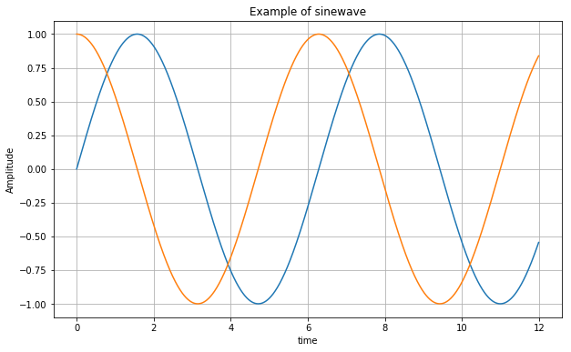

```python
# 필요한 라이브러리 import
# import pandas해도 되지만, 
# padas라이브러리와 관련된 모든 것에 붙여주어야 함으로 as를 쓰면 짧게 줄여서 쓸 수 있어서 좋음.
import pandas as pd
##alt+Enter는 아래에 셀을 추가
#탭키는 자동 완성
```


```python
CCTV_Seoul = pd.read_csv('../data/01. CCTV_in_Seoul.csv',  encoding='utf-8')
CCTV_Seoul.head()
```


<div>
<style scoped>
    .dataframe tbody tr th:only-of-type {
        vertical-align: middle;
    }

    .dataframe tbody tr th {
        vertical-align: top;
    }

    .dataframe thead th {
        text-align: right;
    }
</style>
<table border="1" class="dataframe">
  <thead>
    <tr style="text-align: right;">
      <th></th>
      <th>기관명</th>
      <th>소계</th>
      <th>2013년도 이전</th>
      <th>2014년</th>
      <th>2015년</th>
      <th>2016년</th>
    </tr>
  </thead>
  <tbody>
    <tr>
      <th>0</th>
      <td>강남구</td>
      <td>2780</td>
      <td>1292</td>
      <td>430</td>
      <td>584</td>
      <td>932</td>
    </tr>
    <tr>
      <th>1</th>
      <td>강동구</td>
      <td>773</td>
      <td>379</td>
      <td>99</td>
      <td>155</td>
      <td>377</td>
    </tr>
    <tr>
      <th>2</th>
      <td>강북구</td>
      <td>748</td>
      <td>369</td>
      <td>120</td>
      <td>138</td>
      <td>204</td>
    </tr>
    <tr>
      <th>3</th>
      <td>강서구</td>
      <td>884</td>
      <td>388</td>
      <td>258</td>
      <td>184</td>
      <td>81</td>
    </tr>
    <tr>
      <th>4</th>
      <td>관악구</td>
      <td>1496</td>
      <td>846</td>
      <td>260</td>
      <td>390</td>
      <td>613</td>
    </tr>
  </tbody>
</table>
</div>


```python
#컬럼명 프린트
CCTV_Seoul.columns
```


    Index(['기관명', '소계', '2013년도 이전', '2014년', '2015년', '2016년'], dtype='object')


```python
#인덱스에 따른 컬럼명 프린트
CCTV_Seoul.columns[0]
```


    '기관명'


```python
#첫번째 인덱스 명을 구별로 바꿈. 
#inplace=True는 프린트만 되는 것이 아니라, 원본을 바꾸라는 의미
CCTV_Seoul.rename(columns={CCTV_Seoul.columns[0] : '구별'}, inplace=True)
CCTV_Seoul.head()
```


<div>
<style scoped>
    .dataframe tbody tr th:only-of-type {
        vertical-align: middle;
    }

    .dataframe tbody tr th {
        vertical-align: top;
    }

    .dataframe thead th {
        text-align: right;
    }
</style>
<table border="1" class="dataframe">
  <thead>
    <tr style="text-align: right;">
      <th></th>
      <th>구별</th>
      <th>소계</th>
      <th>2013년도 이전</th>
      <th>2014년</th>
      <th>2015년</th>
      <th>2016년</th>
    </tr>
  </thead>
  <tbody>
    <tr>
      <th>0</th>
      <td>강남구</td>
      <td>2780</td>
      <td>1292</td>
      <td>430</td>
      <td>584</td>
      <td>932</td>
    </tr>
    <tr>
      <th>1</th>
      <td>강동구</td>
      <td>773</td>
      <td>379</td>
      <td>99</td>
      <td>155</td>
      <td>377</td>
    </tr>
    <tr>
      <th>2</th>
      <td>강북구</td>
      <td>748</td>
      <td>369</td>
      <td>120</td>
      <td>138</td>
      <td>204</td>
    </tr>
    <tr>
      <th>3</th>
      <td>강서구</td>
      <td>884</td>
      <td>388</td>
      <td>258</td>
      <td>184</td>
      <td>81</td>
    </tr>
    <tr>
      <th>4</th>
      <td>관악구</td>
      <td>1496</td>
      <td>846</td>
      <td>260</td>
      <td>390</td>
      <td>613</td>
    </tr>
  </tbody>
</table>
</div>


## 2-2. 엑셀파일 읽기 - 서울시 인구현황


```python
pop_Seoul = pd.read_excel('../data/01. population_in_Seoul.xls',  encoding='utf-8')
pop_Seoul.head()
# 첫 행과 두번째 행이 header가 되어 이상하게 읽어옴.
```


<div>
<style scoped>
    .dataframe tbody tr th:only-of-type {
        vertical-align: middle;
    }

    .dataframe tbody tr th {
        vertical-align: top;
    }

    .dataframe thead th {
        text-align: right;
    }
</style>
<table border="1" class="dataframe">
  <thead>
    <tr style="text-align: right;">
      <th></th>
      <th>기간</th>
      <th>자치구</th>
      <th>세대</th>
      <th>인구</th>
      <th>인구.1</th>
      <th>인구.2</th>
      <th>인구.3</th>
      <th>인구.4</th>
      <th>인구.5</th>
      <th>인구.6</th>
      <th>인구.7</th>
      <th>인구.8</th>
      <th>세대당인구</th>
      <th>65세이상고령자</th>
    </tr>
  </thead>
  <tbody>
    <tr>
      <th>0</th>
      <td>기간</td>
      <td>자치구</td>
      <td>세대</td>
      <td>합계</td>
      <td>합계</td>
      <td>합계</td>
      <td>한국인</td>
      <td>한국인</td>
      <td>한국인</td>
      <td>등록외국인</td>
      <td>등록외국인</td>
      <td>등록외국인</td>
      <td>세대당인구</td>
      <td>65세이상고령자</td>
    </tr>
    <tr>
      <th>1</th>
      <td>기간</td>
      <td>자치구</td>
      <td>세대</td>
      <td>계</td>
      <td>남자</td>
      <td>여자</td>
      <td>계</td>
      <td>남자</td>
      <td>여자</td>
      <td>계</td>
      <td>남자</td>
      <td>여자</td>
      <td>세대당인구</td>
      <td>65세이상고령자</td>
    </tr>
    <tr>
      <th>2</th>
      <td>2017.1/4</td>
      <td>합계</td>
      <td>4202888</td>
      <td>10197604</td>
      <td>5000005</td>
      <td>5197599</td>
      <td>9926968</td>
      <td>4871560</td>
      <td>5055408</td>
      <td>270636</td>
      <td>128445</td>
      <td>142191</td>
      <td>2.36</td>
      <td>1321458</td>
    </tr>
    <tr>
      <th>3</th>
      <td>2017.1/4</td>
      <td>종로구</td>
      <td>72654</td>
      <td>162820</td>
      <td>79675</td>
      <td>83145</td>
      <td>153589</td>
      <td>75611</td>
      <td>77978</td>
      <td>9231</td>
      <td>4064</td>
      <td>5167</td>
      <td>2.11</td>
      <td>25425</td>
    </tr>
    <tr>
      <th>4</th>
      <td>2017.1/4</td>
      <td>중구</td>
      <td>59481</td>
      <td>133240</td>
      <td>65790</td>
      <td>67450</td>
      <td>124312</td>
      <td>61656</td>
      <td>62656</td>
      <td>8928</td>
      <td>4134</td>
      <td>4794</td>
      <td>2.09</td>
      <td>20764</td>
    </tr>
  </tbody>
</table>
</div>


```python
pop_Seoul = pd.read_excel('../data/01. population_in_Seoul.xls', 
                          header = 2,
                          usecols = 'B, D, G, J, N',
                          encoding='utf-8')
pop_Seoul.head()
#header가 세번째 줄, 인덱스는 2부터라는 셋팅, 
#엑셀의 열 중 B, D, G, J, N만을 사용.
```


<div>
<style scoped>
    .dataframe tbody tr th:only-of-type {
        vertical-align: middle;
    }

    .dataframe tbody tr th {
        vertical-align: top;
    }

    .dataframe thead th {
        text-align: right;
    }
</style>
<table border="1" class="dataframe">
  <thead>
    <tr style="text-align: right;">
      <th></th>
      <th>자치구</th>
      <th>계</th>
      <th>계.1</th>
      <th>계.2</th>
      <th>65세이상고령자</th>
    </tr>
  </thead>
  <tbody>
    <tr>
      <th>0</th>
      <td>합계</td>
      <td>10197604.0</td>
      <td>9926968.0</td>
      <td>270636.0</td>
      <td>1321458.0</td>
    </tr>
    <tr>
      <th>1</th>
      <td>종로구</td>
      <td>162820.0</td>
      <td>153589.0</td>
      <td>9231.0</td>
      <td>25425.0</td>
    </tr>
    <tr>
      <th>2</th>
      <td>중구</td>
      <td>133240.0</td>
      <td>124312.0</td>
      <td>8928.0</td>
      <td>20764.0</td>
    </tr>
    <tr>
      <th>3</th>
      <td>용산구</td>
      <td>244203.0</td>
      <td>229456.0</td>
      <td>14747.0</td>
      <td>36231.0</td>
    </tr>
    <tr>
      <th>4</th>
      <td>성동구</td>
      <td>311244.0</td>
      <td>303380.0</td>
      <td>7864.0</td>
      <td>39997.0</td>
    </tr>
  </tbody>
</table>
</div>


```python
pop_Seoul.rename(columns={pop_Seoul.columns[0] : '구별', 
                          pop_Seoul.columns[1] : '인구수', 
                          pop_Seoul.columns[2] : '한국인', 
                          pop_Seoul.columns[3] : '외국인', 
                          pop_Seoul.columns[4] : '고령자'}, inplace=True)
pop_Seoul.head()
#하나씩 컬럼 명을 변경함.
```


<div>
<style scoped>
    .dataframe tbody tr th:only-of-type {
        vertical-align: middle;
    }

    .dataframe tbody tr th {
        vertical-align: top;
    }

    .dataframe thead th {
        text-align: right;
    }
</style>
<table border="1" class="dataframe">
  <thead>
    <tr style="text-align: right;">
      <th></th>
      <th>구별</th>
      <th>인구수</th>
      <th>한국인</th>
      <th>외국인</th>
      <th>고령자</th>
    </tr>
  </thead>
  <tbody>
    <tr>
      <th>0</th>
      <td>합계</td>
      <td>10197604.0</td>
      <td>9926968.0</td>
      <td>270636.0</td>
      <td>1321458.0</td>
    </tr>
    <tr>
      <th>1</th>
      <td>종로구</td>
      <td>162820.0</td>
      <td>153589.0</td>
      <td>9231.0</td>
      <td>25425.0</td>
    </tr>
    <tr>
      <th>2</th>
      <td>중구</td>
      <td>133240.0</td>
      <td>124312.0</td>
      <td>8928.0</td>
      <td>20764.0</td>
    </tr>
    <tr>
      <th>3</th>
      <td>용산구</td>
      <td>244203.0</td>
      <td>229456.0</td>
      <td>14747.0</td>
      <td>36231.0</td>
    </tr>
    <tr>
      <th>4</th>
      <td>성동구</td>
      <td>311244.0</td>
      <td>303380.0</td>
      <td>7864.0</td>
      <td>39997.0</td>
    </tr>
  </tbody>
</table>
</div>


# 3. Pandas 기초


```python
import pandas as pd
import numpy as np
```


```python
# 이 둘은 자주 같이 사용됨.
# Series함수로 파이썬의 리스트를 만듦.
s = pd.Series([1,3,5,np.nan,6,8])
s
```


    0    1.0
    1    3.0
    2    5.0
    3    NaN
    4    6.0
    5    8.0
    dtype: float64


```python
# 2013년 1월 1일부터 시작해서 6일간 datetime형태로 만듦.
dates = pd.date_range('20130101', periods=6)
dates
```


    DatetimeIndex(['2013-01-01', '2013-01-02', '2013-01-03', '2013-01-04',
                   '2013-01-05', '2013-01-06'],
                  dtype='datetime64[ns]', freq='D')


```python
# 랜덤한 값으로 dates를 인덱스(행으로)로 하여 각각의 컬럼을 A,B,C,D로 하여 데이터 프레임을 만듦. 
df = pd.DataFrame(np.random.randn(6,4), index=dates, 
                  columns=['A','B','C','D'])
df
```


<div>
<style scoped>
    .dataframe tbody tr th:only-of-type {
        vertical-align: middle;
    }

    .dataframe tbody tr th {
        vertical-align: top;
    }

    .dataframe thead th {
        text-align: right;
    }
</style>
<table border="1" class="dataframe">
  <thead>
    <tr style="text-align: right;">
      <th></th>
      <th>A</th>
      <th>B</th>
      <th>C</th>
      <th>D</th>
    </tr>
  </thead>
  <tbody>
    <tr>
      <th>2013-01-01</th>
      <td>0.664706</td>
      <td>-1.523079</td>
      <td>0.699755</td>
      <td>-0.564759</td>
    </tr>
    <tr>
      <th>2013-01-02</th>
      <td>-0.498741</td>
      <td>-0.548893</td>
      <td>-0.168366</td>
      <td>0.724138</td>
    </tr>
    <tr>
      <th>2013-01-03</th>
      <td>0.533707</td>
      <td>-0.937383</td>
      <td>-0.872447</td>
      <td>-0.924368</td>
    </tr>
    <tr>
      <th>2013-01-04</th>
      <td>0.838940</td>
      <td>-0.292584</td>
      <td>0.953001</td>
      <td>-0.107595</td>
    </tr>
    <tr>
      <th>2013-01-05</th>
      <td>-0.047171</td>
      <td>-0.995357</td>
      <td>2.970665</td>
      <td>1.019078</td>
    </tr>
    <tr>
      <th>2013-01-06</th>
      <td>-0.532680</td>
      <td>-1.334329</td>
      <td>0.026306</td>
      <td>-1.312302</td>
    </tr>
  </tbody>
</table>
</div>


```python
df.head()
# 5개만 프린트
```


<div>
<style scoped>
    .dataframe tbody tr th:only-of-type {
        vertical-align: middle;
    }

    .dataframe tbody tr th {
        vertical-align: top;
    }

    .dataframe thead th {
        text-align: right;
    }
</style>
<table border="1" class="dataframe">
  <thead>
    <tr style="text-align: right;">
      <th></th>
      <th>A</th>
      <th>B</th>
      <th>C</th>
      <th>D</th>
    </tr>
  </thead>
  <tbody>
    <tr>
      <th>2013-01-01</th>
      <td>0.664706</td>
      <td>-1.523079</td>
      <td>0.699755</td>
      <td>-0.564759</td>
    </tr>
    <tr>
      <th>2013-01-02</th>
      <td>-0.498741</td>
      <td>-0.548893</td>
      <td>-0.168366</td>
      <td>0.724138</td>
    </tr>
    <tr>
      <th>2013-01-03</th>
      <td>0.533707</td>
      <td>-0.937383</td>
      <td>-0.872447</td>
      <td>-0.924368</td>
    </tr>
    <tr>
      <th>2013-01-04</th>
      <td>0.838940</td>
      <td>-0.292584</td>
      <td>0.953001</td>
      <td>-0.107595</td>
    </tr>
    <tr>
      <th>2013-01-05</th>
      <td>-0.047171</td>
      <td>-0.995357</td>
      <td>2.970665</td>
      <td>1.019078</td>
    </tr>
  </tbody>
</table>
</div>


```python
df.head(3)
#3개만 프린트
```


<div>
<style scoped>
    .dataframe tbody tr th:only-of-type {
        vertical-align: middle;
    }

    .dataframe tbody tr th {
        vertical-align: top;
    }

    .dataframe thead th {
        text-align: right;
    }
</style>
<table border="1" class="dataframe">
  <thead>
    <tr style="text-align: right;">
      <th></th>
      <th>A</th>
      <th>B</th>
      <th>C</th>
      <th>D</th>
    </tr>
  </thead>
  <tbody>
    <tr>
      <th>2013-01-01</th>
      <td>0.664706</td>
      <td>-1.523079</td>
      <td>0.699755</td>
      <td>-0.564759</td>
    </tr>
    <tr>
      <th>2013-01-02</th>
      <td>-0.498741</td>
      <td>-0.548893</td>
      <td>-0.168366</td>
      <td>0.724138</td>
    </tr>
    <tr>
      <th>2013-01-03</th>
      <td>0.533707</td>
      <td>-0.937383</td>
      <td>-0.872447</td>
      <td>-0.924368</td>
    </tr>
  </tbody>
</table>
</div>


```python
df.index
#인덱스가 되는 열의 값을 프린트
```


    DatetimeIndex(['2013-01-01', '2013-01-02', '2013-01-03', '2013-01-04',
                   '2013-01-05', '2013-01-06'],
                  dtype='datetime64[ns]', freq='D')


```python
df.columns
#컬럼명 프린트
```


    Index(['A', 'B', 'C', 'D'], dtype='object')


```python
df.values
#값들을 프린트
```


    array([[ 0.66470564, -1.52307856,  0.69975548, -0.5647595 ],
           [-0.49874144, -0.54889271, -0.16836622,  0.7241384 ],
           [ 0.53370672, -0.93738279, -0.87244666, -0.9243684 ],
           [ 0.83894006, -0.29258374,  0.95300104, -0.10759472],
           [-0.04717146, -0.99535665,  2.97066472,  1.0190784 ],
           [-0.5326798 , -1.33432918,  0.02630612, -1.31230222]])


```python
df.info()
#데이터 프레임의 전체 정보를 프린트
```

    <class 'pandas.core.frame.DataFrame'>
    DatetimeIndex: 6 entries, 2013-01-01 to 2013-01-06
    Freq: D
    Data columns (total 4 columns):
    A    6 non-null float64
    B    6 non-null float64
    C    6 non-null float64
    D    6 non-null float64
    dtypes: float64(4)
    memory usage: 240.0 bytes
    


```python
df.describe()
# 데이터 프레임의 통계를 프린트
# R의 summary
```


<div>
<style scoped>
    .dataframe tbody tr th:only-of-type {
        vertical-align: middle;
    }

    .dataframe tbody tr th {
        vertical-align: top;
    }

    .dataframe thead th {
        text-align: right;
    }
</style>
<table border="1" class="dataframe">
  <thead>
    <tr style="text-align: right;">
      <th></th>
      <th>A</th>
      <th>B</th>
      <th>C</th>
      <th>D</th>
    </tr>
  </thead>
  <tbody>
    <tr>
      <th>count</th>
      <td>6.000000</td>
      <td>6.000000</td>
      <td>6.000000</td>
      <td>6.000000</td>
    </tr>
    <tr>
      <th>mean</th>
      <td>0.159793</td>
      <td>-0.938604</td>
      <td>0.601486</td>
      <td>-0.194301</td>
    </tr>
    <tr>
      <th>std</th>
      <td>0.601998</td>
      <td>0.462741</td>
      <td>1.329828</td>
      <td>0.921249</td>
    </tr>
    <tr>
      <th>min</th>
      <td>-0.532680</td>
      <td>-1.523079</td>
      <td>-0.872447</td>
      <td>-1.312302</td>
    </tr>
    <tr>
      <th>25%</th>
      <td>-0.385849</td>
      <td>-1.249586</td>
      <td>-0.119698</td>
      <td>-0.834466</td>
    </tr>
    <tr>
      <th>50%</th>
      <td>0.243268</td>
      <td>-0.966370</td>
      <td>0.363031</td>
      <td>-0.336177</td>
    </tr>
    <tr>
      <th>75%</th>
      <td>0.631956</td>
      <td>-0.646015</td>
      <td>0.889690</td>
      <td>0.516205</td>
    </tr>
    <tr>
      <th>max</th>
      <td>0.838940</td>
      <td>-0.292584</td>
      <td>2.970665</td>
      <td>1.019078</td>
    </tr>
  </tbody>
</table>
</div>


```python
df.sort_values(by='B', ascending=False)
#B열에 이해 내림차순
```


<div>
<style scoped>
    .dataframe tbody tr th:only-of-type {
        vertical-align: middle;
    }

    .dataframe tbody tr th {
        vertical-align: top;
    }

    .dataframe thead th {
        text-align: right;
    }
</style>
<table border="1" class="dataframe">
  <thead>
    <tr style="text-align: right;">
      <th></th>
      <th>A</th>
      <th>B</th>
      <th>C</th>
      <th>D</th>
    </tr>
  </thead>
  <tbody>
    <tr>
      <th>2013-01-04</th>
      <td>0.838940</td>
      <td>-0.292584</td>
      <td>0.953001</td>
      <td>-0.107595</td>
    </tr>
    <tr>
      <th>2013-01-02</th>
      <td>-0.498741</td>
      <td>-0.548893</td>
      <td>-0.168366</td>
      <td>0.724138</td>
    </tr>
    <tr>
      <th>2013-01-03</th>
      <td>0.533707</td>
      <td>-0.937383</td>
      <td>-0.872447</td>
      <td>-0.924368</td>
    </tr>
    <tr>
      <th>2013-01-05</th>
      <td>-0.047171</td>
      <td>-0.995357</td>
      <td>2.970665</td>
      <td>1.019078</td>
    </tr>
    <tr>
      <th>2013-01-06</th>
      <td>-0.532680</td>
      <td>-1.334329</td>
      <td>0.026306</td>
      <td>-1.312302</td>
    </tr>
    <tr>
      <th>2013-01-01</th>
      <td>0.664706</td>
      <td>-1.523079</td>
      <td>0.699755</td>
      <td>-0.564759</td>
    </tr>
  </tbody>
</table>
</div>


```python
df
```


<div>
<style scoped>
    .dataframe tbody tr th:only-of-type {
        vertical-align: middle;
    }

    .dataframe tbody tr th {
        vertical-align: top;
    }

    .dataframe thead th {
        text-align: right;
    }
</style>
<table border="1" class="dataframe">
  <thead>
    <tr style="text-align: right;">
      <th></th>
      <th>A</th>
      <th>B</th>
      <th>C</th>
      <th>D</th>
    </tr>
  </thead>
  <tbody>
    <tr>
      <th>2013-01-01</th>
      <td>0.664706</td>
      <td>-1.523079</td>
      <td>0.699755</td>
      <td>-0.564759</td>
    </tr>
    <tr>
      <th>2013-01-02</th>
      <td>-0.498741</td>
      <td>-0.548893</td>
      <td>-0.168366</td>
      <td>0.724138</td>
    </tr>
    <tr>
      <th>2013-01-03</th>
      <td>0.533707</td>
      <td>-0.937383</td>
      <td>-0.872447</td>
      <td>-0.924368</td>
    </tr>
    <tr>
      <th>2013-01-04</th>
      <td>0.838940</td>
      <td>-0.292584</td>
      <td>0.953001</td>
      <td>-0.107595</td>
    </tr>
    <tr>
      <th>2013-01-05</th>
      <td>-0.047171</td>
      <td>-0.995357</td>
      <td>2.970665</td>
      <td>1.019078</td>
    </tr>
    <tr>
      <th>2013-01-06</th>
      <td>-0.532680</td>
      <td>-1.334329</td>
      <td>0.026306</td>
      <td>-1.312302</td>
    </tr>
  </tbody>
</table>
</div>


```python
df['A']
#A열 프린트
```


    2013-01-01    0.664706
    2013-01-02   -0.498741
    2013-01-03    0.533707
    2013-01-04    0.838940
    2013-01-05   -0.047171
    2013-01-06   -0.532680
    Freq: D, Name: A, dtype: float64


```python
df[0:3]
#0행부터 3보다 하나 작은 행까지 출력
```


<div>
<style scoped>
    .dataframe tbody tr th:only-of-type {
        vertical-align: middle;
    }

    .dataframe tbody tr th {
        vertical-align: top;
    }

    .dataframe thead th {
        text-align: right;
    }
</style>
<table border="1" class="dataframe">
  <thead>
    <tr style="text-align: right;">
      <th></th>
      <th>A</th>
      <th>B</th>
      <th>C</th>
      <th>D</th>
    </tr>
  </thead>
  <tbody>
    <tr>
      <th>2013-01-01</th>
      <td>0.664706</td>
      <td>-1.523079</td>
      <td>0.699755</td>
      <td>-0.564759</td>
    </tr>
    <tr>
      <th>2013-01-02</th>
      <td>-0.498741</td>
      <td>-0.548893</td>
      <td>-0.168366</td>
      <td>0.724138</td>
    </tr>
    <tr>
      <th>2013-01-03</th>
      <td>0.533707</td>
      <td>-0.937383</td>
      <td>-0.872447</td>
      <td>-0.924368</td>
    </tr>
  </tbody>
</table>
</div>


```python
df['20130102':'20130104']
# 행의 인덱스 값으로 슬라이싱 하고 싶은 경우
```


<div>
<style scoped>
    .dataframe tbody tr th:only-of-type {
        vertical-align: middle;
    }

    .dataframe tbody tr th {
        vertical-align: top;
    }

    .dataframe thead th {
        text-align: right;
    }
</style>
<table border="1" class="dataframe">
  <thead>
    <tr style="text-align: right;">
      <th></th>
      <th>A</th>
      <th>B</th>
      <th>C</th>
      <th>D</th>
    </tr>
  </thead>
  <tbody>
    <tr>
      <th>2013-01-02</th>
      <td>-0.498741</td>
      <td>-0.548893</td>
      <td>-0.168366</td>
      <td>0.724138</td>
    </tr>
    <tr>
      <th>2013-01-03</th>
      <td>0.533707</td>
      <td>-0.937383</td>
      <td>-0.872447</td>
      <td>-0.924368</td>
    </tr>
    <tr>
      <th>2013-01-04</th>
      <td>0.838940</td>
      <td>-0.292584</td>
      <td>0.953001</td>
      <td>-0.107595</td>
    </tr>
  </tbody>
</table>
</div>


```python
df.loc[dates[0]]
# 위에서 사용했던 변수를 이용해서 슬라이싱 하고 싶은 경우
```


    A    0.664706
    B   -1.523079
    C    0.699755
    D   -0.564759
    Name: 2013-01-01 00:00:00, dtype: float64


```python
df.loc[:,['A','B']]
#모든 행, A,B열 만 슬라이싱
#행과 열을 함께 슬라이싱하고자 하는 경우 loc함수 사용해야 함.
#loc는 location
```


<div>
<style scoped>
    .dataframe tbody tr th:only-of-type {
        vertical-align: middle;
    }

    .dataframe tbody tr th {
        vertical-align: top;
    }

    .dataframe thead th {
        text-align: right;
    }
</style>
<table border="1" class="dataframe">
  <thead>
    <tr style="text-align: right;">
      <th></th>
      <th>A</th>
      <th>B</th>
    </tr>
  </thead>
  <tbody>
    <tr>
      <th>2013-01-01</th>
      <td>0.664706</td>
      <td>-1.523079</td>
    </tr>
    <tr>
      <th>2013-01-02</th>
      <td>-0.498741</td>
      <td>-0.548893</td>
    </tr>
    <tr>
      <th>2013-01-03</th>
      <td>0.533707</td>
      <td>-0.937383</td>
    </tr>
    <tr>
      <th>2013-01-04</th>
      <td>0.838940</td>
      <td>-0.292584</td>
    </tr>
    <tr>
      <th>2013-01-05</th>
      <td>-0.047171</td>
      <td>-0.995357</td>
    </tr>
    <tr>
      <th>2013-01-06</th>
      <td>-0.532680</td>
      <td>-1.334329</td>
    </tr>
  </tbody>
</table>
</div>


```python
df.loc['20130102':'20130104',['A','B']]
```


<div>
<style scoped>
    .dataframe tbody tr th:only-of-type {
        vertical-align: middle;
    }

    .dataframe tbody tr th {
        vertical-align: top;
    }

    .dataframe thead th {
        text-align: right;
    }
</style>
<table border="1" class="dataframe">
  <thead>
    <tr style="text-align: right;">
      <th></th>
      <th>A</th>
      <th>B</th>
    </tr>
  </thead>
  <tbody>
    <tr>
      <th>2013-01-02</th>
      <td>-0.498741</td>
      <td>-0.548893</td>
    </tr>
    <tr>
      <th>2013-01-03</th>
      <td>0.533707</td>
      <td>-0.937383</td>
    </tr>
    <tr>
      <th>2013-01-04</th>
      <td>0.838940</td>
      <td>-0.292584</td>
    </tr>
  </tbody>
</table>
</div>


```python
df.loc['20130102',['A','B']]
```


    A   -0.498741
    B   -0.548893
    Name: 2013-01-02 00:00:00, dtype: float64


```python
df.loc[dates[0],'A']
```


    0.6647056391875068


```python
df.iloc[3]
#인덱스로 슬라이싱하고자 하는 경우 iloc
```


    A    0.838940
    B   -0.292584
    C    0.953001
    D   -0.107595
    Name: 2013-01-04 00:00:00, dtype: float64


```python
df.iloc[3:5,0:2]
#3~4까지의 행, 0부터 1까지의 열을 슬라이싱
```


<div>
<style scoped>
    .dataframe tbody tr th:only-of-type {
        vertical-align: middle;
    }

    .dataframe tbody tr th {
        vertical-align: top;
    }

    .dataframe thead th {
        text-align: right;
    }
</style>
<table border="1" class="dataframe">
  <thead>
    <tr style="text-align: right;">
      <th></th>
      <th>A</th>
      <th>B</th>
    </tr>
  </thead>
  <tbody>
    <tr>
      <th>2013-01-04</th>
      <td>0.838940</td>
      <td>-0.292584</td>
    </tr>
    <tr>
      <th>2013-01-05</th>
      <td>-0.047171</td>
      <td>-0.995357</td>
    </tr>
  </tbody>
</table>
</div>


```python
df.iloc[[1,2,4],[0,2]]
#1,2,4의 행, 0부터 1까자의 열을 슬라이싱
```


<div>
<style scoped>
    .dataframe tbody tr th:only-of-type {
        vertical-align: middle;
    }

    .dataframe tbody tr th {
        vertical-align: top;
    }

    .dataframe thead th {
        text-align: right;
    }
</style>
<table border="1" class="dataframe">
  <thead>
    <tr style="text-align: right;">
      <th></th>
      <th>A</th>
      <th>C</th>
    </tr>
  </thead>
  <tbody>
    <tr>
      <th>2013-01-02</th>
      <td>-0.498741</td>
      <td>-0.168366</td>
    </tr>
    <tr>
      <th>2013-01-03</th>
      <td>0.533707</td>
      <td>-0.872447</td>
    </tr>
    <tr>
      <th>2013-01-05</th>
      <td>-0.047171</td>
      <td>2.970665</td>
    </tr>
  </tbody>
</table>
</div>


```python
df.iloc[1:3,:]
#1부터 2까지의 행, 모든 열을 슬라이싱
```


<div>
<style scoped>
    .dataframe tbody tr th:only-of-type {
        vertical-align: middle;
    }

    .dataframe tbody tr th {
        vertical-align: top;
    }

    .dataframe thead th {
        text-align: right;
    }
</style>
<table border="1" class="dataframe">
  <thead>
    <tr style="text-align: right;">
      <th></th>
      <th>A</th>
      <th>B</th>
      <th>C</th>
      <th>D</th>
    </tr>
  </thead>
  <tbody>
    <tr>
      <th>2013-01-02</th>
      <td>-0.498741</td>
      <td>-0.548893</td>
      <td>-0.168366</td>
      <td>0.724138</td>
    </tr>
    <tr>
      <th>2013-01-03</th>
      <td>0.533707</td>
      <td>-0.937383</td>
      <td>-0.872447</td>
      <td>-0.924368</td>
    </tr>
  </tbody>
</table>
</div>


```python
df.iloc[:,1:3]
#모든 행, 1부터 2까지의 열을 슬라이싱
```


<div>
<style scoped>
    .dataframe tbody tr th:only-of-type {
        vertical-align: middle;
    }

    .dataframe tbody tr th {
        vertical-align: top;
    }

    .dataframe thead th {
        text-align: right;
    }
</style>
<table border="1" class="dataframe">
  <thead>
    <tr style="text-align: right;">
      <th></th>
      <th>B</th>
      <th>C</th>
    </tr>
  </thead>
  <tbody>
    <tr>
      <th>2013-01-01</th>
      <td>-1.523079</td>
      <td>0.699755</td>
    </tr>
    <tr>
      <th>2013-01-02</th>
      <td>-0.548893</td>
      <td>-0.168366</td>
    </tr>
    <tr>
      <th>2013-01-03</th>
      <td>-0.937383</td>
      <td>-0.872447</td>
    </tr>
    <tr>
      <th>2013-01-04</th>
      <td>-0.292584</td>
      <td>0.953001</td>
    </tr>
    <tr>
      <th>2013-01-05</th>
      <td>-0.995357</td>
      <td>2.970665</td>
    </tr>
    <tr>
      <th>2013-01-06</th>
      <td>-1.334329</td>
      <td>0.026306</td>
    </tr>
  </tbody>
</table>
</div>


```python
df
```


<div>
<style scoped>
    .dataframe tbody tr th:only-of-type {
        vertical-align: middle;
    }

    .dataframe tbody tr th {
        vertical-align: top;
    }

    .dataframe thead th {
        text-align: right;
    }
</style>
<table border="1" class="dataframe">
  <thead>
    <tr style="text-align: right;">
      <th></th>
      <th>A</th>
      <th>B</th>
      <th>C</th>
      <th>D</th>
    </tr>
  </thead>
  <tbody>
    <tr>
      <th>2013-01-01</th>
      <td>0.664706</td>
      <td>-1.523079</td>
      <td>0.699755</td>
      <td>-0.564759</td>
    </tr>
    <tr>
      <th>2013-01-02</th>
      <td>-0.498741</td>
      <td>-0.548893</td>
      <td>-0.168366</td>
      <td>0.724138</td>
    </tr>
    <tr>
      <th>2013-01-03</th>
      <td>0.533707</td>
      <td>-0.937383</td>
      <td>-0.872447</td>
      <td>-0.924368</td>
    </tr>
    <tr>
      <th>2013-01-04</th>
      <td>0.838940</td>
      <td>-0.292584</td>
      <td>0.953001</td>
      <td>-0.107595</td>
    </tr>
    <tr>
      <th>2013-01-05</th>
      <td>-0.047171</td>
      <td>-0.995357</td>
      <td>2.970665</td>
      <td>1.019078</td>
    </tr>
    <tr>
      <th>2013-01-06</th>
      <td>-0.532680</td>
      <td>-1.334329</td>
      <td>0.026306</td>
      <td>-1.312302</td>
    </tr>
  </tbody>
</table>
</div>


```python
df[df.A > 0]
#조건을 주어 슬라이싱
#df데이터 프레임 중 A열의 값이 0보다 큰 것만 슬라이싱
```


<div>
<style scoped>
    .dataframe tbody tr th:only-of-type {
        vertical-align: middle;
    }

    .dataframe tbody tr th {
        vertical-align: top;
    }

    .dataframe thead th {
        text-align: right;
    }
</style>
<table border="1" class="dataframe">
  <thead>
    <tr style="text-align: right;">
      <th></th>
      <th>A</th>
      <th>B</th>
      <th>C</th>
      <th>D</th>
    </tr>
  </thead>
  <tbody>
    <tr>
      <th>2013-01-01</th>
      <td>0.664706</td>
      <td>-1.523079</td>
      <td>0.699755</td>
      <td>-0.564759</td>
    </tr>
    <tr>
      <th>2013-01-03</th>
      <td>0.533707</td>
      <td>-0.937383</td>
      <td>-0.872447</td>
      <td>-0.924368</td>
    </tr>
    <tr>
      <th>2013-01-04</th>
      <td>0.838940</td>
      <td>-0.292584</td>
      <td>0.953001</td>
      <td>-0.107595</td>
    </tr>
  </tbody>
</table>
</div>


```python
df[df > 0]
#df 데이터 프레임의 값 들 중 0보다 큰 것만 슬라이싱
```


<div>
<style scoped>
    .dataframe tbody tr th:only-of-type {
        vertical-align: middle;
    }

    .dataframe tbody tr th {
        vertical-align: top;
    }

    .dataframe thead th {
        text-align: right;
    }
</style>
<table border="1" class="dataframe">
  <thead>
    <tr style="text-align: right;">
      <th></th>
      <th>A</th>
      <th>B</th>
      <th>C</th>
      <th>D</th>
    </tr>
  </thead>
  <tbody>
    <tr>
      <th>2013-01-01</th>
      <td>NaN</td>
      <td>1.721902</td>
      <td>1.504338</td>
      <td>NaN</td>
    </tr>
    <tr>
      <th>2013-01-02</th>
      <td>1.066098</td>
      <td>NaN</td>
      <td>NaN</td>
      <td>0.111317</td>
    </tr>
    <tr>
      <th>2013-01-03</th>
      <td>NaN</td>
      <td>NaN</td>
      <td>0.287994</td>
      <td>0.436572</td>
    </tr>
    <tr>
      <th>2013-01-04</th>
      <td>NaN</td>
      <td>0.163761</td>
      <td>NaN</td>
      <td>NaN</td>
    </tr>
    <tr>
      <th>2013-01-05</th>
      <td>0.448486</td>
      <td>NaN</td>
      <td>NaN</td>
      <td>NaN</td>
    </tr>
    <tr>
      <th>2013-01-06</th>
      <td>0.100995</td>
      <td>1.018646</td>
      <td>0.061224</td>
      <td>0.860012</td>
    </tr>
  </tbody>
</table>
</div>


```python
df2 = df.copy()
#데이터프레임 복사
```


```python
df2['E'] = ['one', 'one','two','three','four','three']
df2
#파생 변수 만들기
```


<div>
<style scoped>
    .dataframe tbody tr th:only-of-type {
        vertical-align: middle;
    }

    .dataframe tbody tr th {
        vertical-align: top;
    }

    .dataframe thead th {
        text-align: right;
    }
</style>
<table border="1" class="dataframe">
  <thead>
    <tr style="text-align: right;">
      <th></th>
      <th>A</th>
      <th>B</th>
      <th>C</th>
      <th>D</th>
      <th>E</th>
    </tr>
  </thead>
  <tbody>
    <tr>
      <th>2013-01-01</th>
      <td>-0.165321</td>
      <td>-1.434325</td>
      <td>0.718575</td>
      <td>0.991314</td>
      <td>one</td>
    </tr>
    <tr>
      <th>2013-01-02</th>
      <td>0.467995</td>
      <td>0.897531</td>
      <td>0.034734</td>
      <td>-1.398059</td>
      <td>one</td>
    </tr>
    <tr>
      <th>2013-01-03</th>
      <td>-0.407508</td>
      <td>0.372808</td>
      <td>-0.124425</td>
      <td>0.450209</td>
      <td>two</td>
    </tr>
    <tr>
      <th>2013-01-04</th>
      <td>0.907661</td>
      <td>-1.875835</td>
      <td>-0.546840</td>
      <td>0.482259</td>
      <td>three</td>
    </tr>
    <tr>
      <th>2013-01-05</th>
      <td>-0.749502</td>
      <td>1.172480</td>
      <td>-0.223593</td>
      <td>-0.189439</td>
      <td>four</td>
    </tr>
    <tr>
      <th>2013-01-06</th>
      <td>0.611413</td>
      <td>-1.559226</td>
      <td>0.135637</td>
      <td>1.178983</td>
      <td>three</td>
    </tr>
  </tbody>
</table>
</div>


```python
df2['E'].isin(['two','four'])
#E열에 해당 값들이 있는지 확인
```


    2013-01-01    False
    2013-01-02    False
    2013-01-03     True
    2013-01-04    False
    2013-01-05     True
    2013-01-06    False
    Freq: D, Name: E, dtype: bool


```python
df2[df2['E'].isin(['two','four'])]
#E열에 해당 값들이 있는지 확인하여 그 결과값만 프린트
```


<div>
<style scoped>
    .dataframe tbody tr th:only-of-type {
        vertical-align: middle;
    }

    .dataframe tbody tr th {
        vertical-align: top;
    }

    .dataframe thead th {
        text-align: right;
    }
</style>
<table border="1" class="dataframe">
  <thead>
    <tr style="text-align: right;">
      <th></th>
      <th>A</th>
      <th>B</th>
      <th>C</th>
      <th>D</th>
      <th>E</th>
    </tr>
  </thead>
  <tbody>
    <tr>
      <th>2013-01-03</th>
      <td>-0.407508</td>
      <td>0.372808</td>
      <td>-0.124425</td>
      <td>0.450209</td>
      <td>two</td>
    </tr>
    <tr>
      <th>2013-01-05</th>
      <td>-0.749502</td>
      <td>1.172480</td>
      <td>-0.223593</td>
      <td>-0.189439</td>
      <td>four</td>
    </tr>
  </tbody>
</table>
</div>


```python
df
```


<div>
<style scoped>
    .dataframe tbody tr th:only-of-type {
        vertical-align: middle;
    }

    .dataframe tbody tr th {
        vertical-align: top;
    }

    .dataframe thead th {
        text-align: right;
    }
</style>
<table border="1" class="dataframe">
  <thead>
    <tr style="text-align: right;">
      <th></th>
      <th>A</th>
      <th>B</th>
      <th>C</th>
      <th>D</th>
    </tr>
  </thead>
  <tbody>
    <tr>
      <th>2013-01-01</th>
      <td>-0.174929</td>
      <td>1.721902</td>
      <td>1.504338</td>
      <td>-0.580743</td>
    </tr>
    <tr>
      <th>2013-01-02</th>
      <td>1.066098</td>
      <td>-0.992334</td>
      <td>-0.412700</td>
      <td>0.111317</td>
    </tr>
    <tr>
      <th>2013-01-03</th>
      <td>-0.899768</td>
      <td>-0.667389</td>
      <td>0.287994</td>
      <td>0.436572</td>
    </tr>
    <tr>
      <th>2013-01-04</th>
      <td>-1.276879</td>
      <td>0.163761</td>
      <td>-0.181982</td>
      <td>-1.680480</td>
    </tr>
    <tr>
      <th>2013-01-05</th>
      <td>0.448486</td>
      <td>-0.442263</td>
      <td>-0.299058</td>
      <td>-0.285819</td>
    </tr>
    <tr>
      <th>2013-01-06</th>
      <td>0.100995</td>
      <td>1.018646</td>
      <td>0.061224</td>
      <td>0.860012</td>
    </tr>
  </tbody>
</table>
</div>


```python
df.apply(np.cumsum)
#df를 이용.numpy의 누적합 함수 적용하여 프린트
```


<div>
<style scoped>
    .dataframe tbody tr th:only-of-type {
        vertical-align: middle;
    }

    .dataframe tbody tr th {
        vertical-align: top;
    }

    .dataframe thead th {
        text-align: right;
    }
</style>
<table border="1" class="dataframe">
  <thead>
    <tr style="text-align: right;">
      <th></th>
      <th>A</th>
      <th>B</th>
      <th>C</th>
      <th>D</th>
    </tr>
  </thead>
  <tbody>
    <tr>
      <th>2013-01-01</th>
      <td>-0.165321</td>
      <td>-1.434325</td>
      <td>0.718575</td>
      <td>0.991314</td>
    </tr>
    <tr>
      <th>2013-01-02</th>
      <td>0.302675</td>
      <td>-0.536794</td>
      <td>0.753308</td>
      <td>-0.406745</td>
    </tr>
    <tr>
      <th>2013-01-03</th>
      <td>-0.104833</td>
      <td>-0.163986</td>
      <td>0.628883</td>
      <td>0.043464</td>
    </tr>
    <tr>
      <th>2013-01-04</th>
      <td>0.802827</td>
      <td>-2.039822</td>
      <td>0.082044</td>
      <td>0.525723</td>
    </tr>
    <tr>
      <th>2013-01-05</th>
      <td>0.053325</td>
      <td>-0.867342</td>
      <td>-0.141549</td>
      <td>0.336284</td>
    </tr>
    <tr>
      <th>2013-01-06</th>
      <td>0.664738</td>
      <td>-2.426568</td>
      <td>-0.005913</td>
      <td>1.515267</td>
    </tr>
  </tbody>
</table>
</div>


```python
df.apply(lambda x: x.max() - x.min())
# 람다는 함수를 더 단순하게 쓸 수 있는 문법
# x는 열을 의미
# df중 A열의 최대값과 최소값을 구해서 프린트
```


    A    1.657163
    B    3.048315
    C    1.265414
    D    2.577042
    dtype: float64


```python
df
```


<div>
<style scoped>
    .dataframe tbody tr th:only-of-type {
        vertical-align: middle;
    }

    .dataframe tbody tr th {
        vertical-align: top;
    }

    .dataframe thead th {
        text-align: right;
    }
</style>
<table border="1" class="dataframe">
  <thead>
    <tr style="text-align: right;">
      <th></th>
      <th>A</th>
      <th>B</th>
      <th>C</th>
      <th>D</th>
    </tr>
  </thead>
  <tbody>
    <tr>
      <th>2013-01-01</th>
      <td>-0.165321</td>
      <td>-1.434325</td>
      <td>0.718575</td>
      <td>0.991314</td>
    </tr>
    <tr>
      <th>2013-01-02</th>
      <td>0.467995</td>
      <td>0.897531</td>
      <td>0.034734</td>
      <td>-1.398059</td>
    </tr>
    <tr>
      <th>2013-01-03</th>
      <td>-0.407508</td>
      <td>0.372808</td>
      <td>-0.124425</td>
      <td>0.450209</td>
    </tr>
    <tr>
      <th>2013-01-04</th>
      <td>0.907661</td>
      <td>-1.875835</td>
      <td>-0.546840</td>
      <td>0.482259</td>
    </tr>
    <tr>
      <th>2013-01-05</th>
      <td>-0.749502</td>
      <td>1.172480</td>
      <td>-0.223593</td>
      <td>-0.189439</td>
    </tr>
    <tr>
      <th>2013-01-06</th>
      <td>0.611413</td>
      <td>-1.559226</td>
      <td>0.135637</td>
      <td>1.178983</td>
    </tr>
  </tbody>
</table>
</div>


# 4. CCTV 데이터 파악하기


```python
CCTV_Seoul.head()
```


<div>
<style scoped>
    .dataframe tbody tr th:only-of-type {
        vertical-align: middle;
    }

    .dataframe tbody tr th {
        vertical-align: top;
    }

    .dataframe thead th {
        text-align: right;
    }
</style>
<table border="1" class="dataframe">
  <thead>
    <tr style="text-align: right;">
      <th></th>
      <th>구별</th>
      <th>소계</th>
      <th>2013년도 이전</th>
      <th>2014년</th>
      <th>2015년</th>
      <th>2016년</th>
    </tr>
  </thead>
  <tbody>
    <tr>
      <th>0</th>
      <td>강남구</td>
      <td>2780</td>
      <td>1292</td>
      <td>430</td>
      <td>584</td>
      <td>932</td>
    </tr>
    <tr>
      <th>1</th>
      <td>강동구</td>
      <td>773</td>
      <td>379</td>
      <td>99</td>
      <td>155</td>
      <td>377</td>
    </tr>
    <tr>
      <th>2</th>
      <td>강북구</td>
      <td>748</td>
      <td>369</td>
      <td>120</td>
      <td>138</td>
      <td>204</td>
    </tr>
    <tr>
      <th>3</th>
      <td>강서구</td>
      <td>884</td>
      <td>388</td>
      <td>258</td>
      <td>184</td>
      <td>81</td>
    </tr>
    <tr>
      <th>4</th>
      <td>관악구</td>
      <td>1496</td>
      <td>846</td>
      <td>260</td>
      <td>390</td>
      <td>613</td>
    </tr>
  </tbody>
</table>
</div>


```python
CCTV_Seoul.sort_values(by='소계', ascending=True).head(5)
#소계를 가지고 오름차순
```


<div>
<style scoped>
    .dataframe tbody tr th:only-of-type {
        vertical-align: middle;
    }

    .dataframe tbody tr th {
        vertical-align: top;
    }

    .dataframe thead th {
        text-align: right;
    }
</style>
<table border="1" class="dataframe">
  <thead>
    <tr style="text-align: right;">
      <th></th>
      <th>구별</th>
      <th>소계</th>
      <th>2013년도 이전</th>
      <th>2014년</th>
      <th>2015년</th>
      <th>2016년</th>
    </tr>
  </thead>
  <tbody>
    <tr>
      <th>9</th>
      <td>도봉구</td>
      <td>485</td>
      <td>238</td>
      <td>159</td>
      <td>42</td>
      <td>386</td>
    </tr>
    <tr>
      <th>12</th>
      <td>마포구</td>
      <td>574</td>
      <td>314</td>
      <td>118</td>
      <td>169</td>
      <td>379</td>
    </tr>
    <tr>
      <th>17</th>
      <td>송파구</td>
      <td>618</td>
      <td>529</td>
      <td>21</td>
      <td>68</td>
      <td>463</td>
    </tr>
    <tr>
      <th>24</th>
      <td>중랑구</td>
      <td>660</td>
      <td>509</td>
      <td>121</td>
      <td>177</td>
      <td>109</td>
    </tr>
    <tr>
      <th>23</th>
      <td>중구</td>
      <td>671</td>
      <td>413</td>
      <td>190</td>
      <td>72</td>
      <td>348</td>
    </tr>
  </tbody>
</table>
</div>


```python
CCTV_Seoul.sort_values(by='소계', ascending=False).head(5)
#소계를 가지고 내림차순
```


<div>
<style scoped>
    .dataframe tbody tr th:only-of-type {
        vertical-align: middle;
    }

    .dataframe tbody tr th {
        vertical-align: top;
    }

    .dataframe thead th {
        text-align: right;
    }
</style>
<table border="1" class="dataframe">
  <thead>
    <tr style="text-align: right;">
      <th></th>
      <th>구별</th>
      <th>소계</th>
      <th>2013년도 이전</th>
      <th>2014년</th>
      <th>2015년</th>
      <th>2016년</th>
    </tr>
  </thead>
  <tbody>
    <tr>
      <th>0</th>
      <td>강남구</td>
      <td>2780</td>
      <td>1292</td>
      <td>430</td>
      <td>584</td>
      <td>932</td>
    </tr>
    <tr>
      <th>18</th>
      <td>양천구</td>
      <td>2034</td>
      <td>1843</td>
      <td>142</td>
      <td>30</td>
      <td>467</td>
    </tr>
    <tr>
      <th>14</th>
      <td>서초구</td>
      <td>1930</td>
      <td>1406</td>
      <td>157</td>
      <td>336</td>
      <td>398</td>
    </tr>
    <tr>
      <th>21</th>
      <td>은평구</td>
      <td>1873</td>
      <td>1138</td>
      <td>224</td>
      <td>278</td>
      <td>468</td>
    </tr>
    <tr>
      <th>20</th>
      <td>용산구</td>
      <td>1624</td>
      <td>1368</td>
      <td>218</td>
      <td>112</td>
      <td>398</td>
    </tr>
  </tbody>
</table>
</div>


```python
#파생변수 생성
#최근을 2014, 2015, 2016년으로 보고 2013년도 이번보다 얼마나 증가했는지 비율을 구해보자.
CCTV_Seoul['최근증가율'] = (CCTV_Seoul['2016년'] + CCTV_Seoul['2015년'] + 
                        CCTV_Seoul['2014년']) / CCTV_Seoul['2013년도 이전']  * 100

CCTV_Seoul.sort_values(by='최근증가율', ascending=False).head(5)
```


<div>
<style scoped>
    .dataframe tbody tr th:only-of-type {
        vertical-align: middle;
    }

    .dataframe tbody tr th {
        vertical-align: top;
    }

    .dataframe thead th {
        text-align: right;
    }
</style>
<table border="1" class="dataframe">
  <thead>
    <tr style="text-align: right;">
      <th></th>
      <th>구별</th>
      <th>소계</th>
      <th>2013년도 이전</th>
      <th>2014년</th>
      <th>2015년</th>
      <th>2016년</th>
      <th>최근증가율</th>
    </tr>
  </thead>
  <tbody>
    <tr>
      <th>22</th>
      <td>종로구</td>
      <td>1002</td>
      <td>464</td>
      <td>314</td>
      <td>211</td>
      <td>630</td>
      <td>248.922414</td>
    </tr>
    <tr>
      <th>9</th>
      <td>도봉구</td>
      <td>485</td>
      <td>238</td>
      <td>159</td>
      <td>42</td>
      <td>386</td>
      <td>246.638655</td>
    </tr>
    <tr>
      <th>12</th>
      <td>마포구</td>
      <td>574</td>
      <td>314</td>
      <td>118</td>
      <td>169</td>
      <td>379</td>
      <td>212.101911</td>
    </tr>
    <tr>
      <th>8</th>
      <td>노원구</td>
      <td>1265</td>
      <td>542</td>
      <td>57</td>
      <td>451</td>
      <td>516</td>
      <td>188.929889</td>
    </tr>
    <tr>
      <th>1</th>
      <td>강동구</td>
      <td>773</td>
      <td>379</td>
      <td>99</td>
      <td>155</td>
      <td>377</td>
      <td>166.490765</td>
    </tr>
  </tbody>
</table>
</div>


# 5. 서울시 인구 데이터 파악하기


```python
pop_Seoul.head()
```


<div>
<style scoped>
    .dataframe tbody tr th:only-of-type {
        vertical-align: middle;
    }

    .dataframe tbody tr th {
        vertical-align: top;
    }

    .dataframe thead th {
        text-align: right;
    }
</style>
<table border="1" class="dataframe">
  <thead>
    <tr style="text-align: right;">
      <th></th>
      <th>구별</th>
      <th>인구수</th>
      <th>한국인</th>
      <th>외국인</th>
      <th>고령자</th>
    </tr>
  </thead>
  <tbody>
    <tr>
      <th>0</th>
      <td>합계</td>
      <td>10197604.0</td>
      <td>9926968.0</td>
      <td>270636.0</td>
      <td>1321458.0</td>
    </tr>
    <tr>
      <th>1</th>
      <td>종로구</td>
      <td>162820.0</td>
      <td>153589.0</td>
      <td>9231.0</td>
      <td>25425.0</td>
    </tr>
    <tr>
      <th>2</th>
      <td>중구</td>
      <td>133240.0</td>
      <td>124312.0</td>
      <td>8928.0</td>
      <td>20764.0</td>
    </tr>
    <tr>
      <th>3</th>
      <td>용산구</td>
      <td>244203.0</td>
      <td>229456.0</td>
      <td>14747.0</td>
      <td>36231.0</td>
    </tr>
    <tr>
      <th>4</th>
      <td>성동구</td>
      <td>311244.0</td>
      <td>303380.0</td>
      <td>7864.0</td>
      <td>39997.0</td>
    </tr>
  </tbody>
</table>
</div>


```python
# 0번 행을 삭제하여 원본에 적용=> 합계가 보이는 행
pop_Seoul.drop([0], inplace=True)
pop_Seoul.head()
```


<div>
<style scoped>
    .dataframe tbody tr th:only-of-type {
        vertical-align: middle;
    }

    .dataframe tbody tr th {
        vertical-align: top;
    }

    .dataframe thead th {
        text-align: right;
    }
</style>
<table border="1" class="dataframe">
  <thead>
    <tr style="text-align: right;">
      <th></th>
      <th>구별</th>
      <th>인구수</th>
      <th>한국인</th>
      <th>외국인</th>
      <th>고령자</th>
    </tr>
  </thead>
  <tbody>
    <tr>
      <th>1</th>
      <td>종로구</td>
      <td>162820.0</td>
      <td>153589.0</td>
      <td>9231.0</td>
      <td>25425.0</td>
    </tr>
    <tr>
      <th>2</th>
      <td>중구</td>
      <td>133240.0</td>
      <td>124312.0</td>
      <td>8928.0</td>
      <td>20764.0</td>
    </tr>
    <tr>
      <th>3</th>
      <td>용산구</td>
      <td>244203.0</td>
      <td>229456.0</td>
      <td>14747.0</td>
      <td>36231.0</td>
    </tr>
    <tr>
      <th>4</th>
      <td>성동구</td>
      <td>311244.0</td>
      <td>303380.0</td>
      <td>7864.0</td>
      <td>39997.0</td>
    </tr>
    <tr>
      <th>5</th>
      <td>광진구</td>
      <td>372164.0</td>
      <td>357211.0</td>
      <td>14953.0</td>
      <td>42214.0</td>
    </tr>
  </tbody>
</table>
</div>


```python
#중복허용하지 말고 프린트

pop_Seoul['구별'].unique()
```


    array(['종로구', '중구', '용산구', '성동구', '광진구', '동대문구', '중랑구', '성북구', '강북구',
           '도봉구', '노원구', '은평구', '서대문구', '마포구', '양천구', '강서구', '구로구', '금천구',
           '영등포구', '동작구', '관악구', '서초구', '강남구', '송파구', '강동구', nan],
          dtype=object)


```python
#구별이 null인 행을 프린트
pop_Seoul[pop_Seoul['구별'].isnull()]
```


<div>
<style scoped>
    .dataframe tbody tr th:only-of-type {
        vertical-align: middle;
    }

    .dataframe tbody tr th {
        vertical-align: top;
    }

    .dataframe thead th {
        text-align: right;
    }
</style>
<table border="1" class="dataframe">
  <thead>
    <tr style="text-align: right;">
      <th></th>
      <th>구별</th>
      <th>인구수</th>
      <th>한국인</th>
      <th>외국인</th>
      <th>고령자</th>
    </tr>
  </thead>
  <tbody>
    <tr>
      <th>26</th>
      <td>NaN</td>
      <td>NaN</td>
      <td>NaN</td>
      <td>NaN</td>
      <td>NaN</td>
    </tr>
  </tbody>
</table>
</div>


```python
pop_Seoul.drop([26], inplace=True)
pop_Seoul.head()
#26행을 drop하여 원본에 적용
```


<div>
<style scoped>
    .dataframe tbody tr th:only-of-type {
        vertical-align: middle;
    }

    .dataframe tbody tr th {
        vertical-align: top;
    }

    .dataframe thead th {
        text-align: right;
    }
</style>
<table border="1" class="dataframe">
  <thead>
    <tr style="text-align: right;">
      <th></th>
      <th>구별</th>
      <th>인구수</th>
      <th>한국인</th>
      <th>외국인</th>
      <th>고령자</th>
    </tr>
  </thead>
  <tbody>
    <tr>
      <th>1</th>
      <td>종로구</td>
      <td>162820.0</td>
      <td>153589.0</td>
      <td>9231.0</td>
      <td>25425.0</td>
    </tr>
    <tr>
      <th>2</th>
      <td>중구</td>
      <td>133240.0</td>
      <td>124312.0</td>
      <td>8928.0</td>
      <td>20764.0</td>
    </tr>
    <tr>
      <th>3</th>
      <td>용산구</td>
      <td>244203.0</td>
      <td>229456.0</td>
      <td>14747.0</td>
      <td>36231.0</td>
    </tr>
    <tr>
      <th>4</th>
      <td>성동구</td>
      <td>311244.0</td>
      <td>303380.0</td>
      <td>7864.0</td>
      <td>39997.0</td>
    </tr>
    <tr>
      <th>5</th>
      <td>광진구</td>
      <td>372164.0</td>
      <td>357211.0</td>
      <td>14953.0</td>
      <td>42214.0</td>
    </tr>
  </tbody>
</table>
</div>


```python
pop_Seoul['외국인비율'] = pop_Seoul['외국인'] / pop_Seoul['인구수'] * 100
pop_Seoul['고령자비율'] = pop_Seoul['고령자'] / pop_Seoul['인구수'] * 100
pop_Seoul.head()
# 열삭제는 이름을 넣어준다, pop_Seoul.drop(['고령자비율'], 1)
```


<div>
<style scoped>
    .dataframe tbody tr th:only-of-type {
        vertical-align: middle;
    }

    .dataframe tbody tr th {
        vertical-align: top;
    }

    .dataframe thead th {
        text-align: right;
    }
</style>
<table border="1" class="dataframe">
  <thead>
    <tr style="text-align: right;">
      <th></th>
      <th>구별</th>
      <th>인구수</th>
      <th>한국인</th>
      <th>외국인</th>
      <th>고령자</th>
      <th>외국인비율</th>
      <th>고령자비율</th>
    </tr>
  </thead>
  <tbody>
    <tr>
      <th>1</th>
      <td>종로구</td>
      <td>162820.0</td>
      <td>153589.0</td>
      <td>9231.0</td>
      <td>25425.0</td>
      <td>5.669451</td>
      <td>15.615404</td>
    </tr>
    <tr>
      <th>2</th>
      <td>중구</td>
      <td>133240.0</td>
      <td>124312.0</td>
      <td>8928.0</td>
      <td>20764.0</td>
      <td>6.700690</td>
      <td>15.583909</td>
    </tr>
    <tr>
      <th>3</th>
      <td>용산구</td>
      <td>244203.0</td>
      <td>229456.0</td>
      <td>14747.0</td>
      <td>36231.0</td>
      <td>6.038828</td>
      <td>14.836427</td>
    </tr>
    <tr>
      <th>4</th>
      <td>성동구</td>
      <td>311244.0</td>
      <td>303380.0</td>
      <td>7864.0</td>
      <td>39997.0</td>
      <td>2.526635</td>
      <td>12.850689</td>
    </tr>
    <tr>
      <th>5</th>
      <td>광진구</td>
      <td>372164.0</td>
      <td>357211.0</td>
      <td>14953.0</td>
      <td>42214.0</td>
      <td>4.017852</td>
      <td>11.342849</td>
    </tr>
  </tbody>
</table>
</div>


```python
pop_Seoul.sort_values(by='인구수', ascending=False).head(5)
```


<div>
<style scoped>
    .dataframe tbody tr th:only-of-type {
        vertical-align: middle;
    }

    .dataframe tbody tr th {
        vertical-align: top;
    }

    .dataframe thead th {
        text-align: right;
    }
</style>
<table border="1" class="dataframe">
  <thead>
    <tr style="text-align: right;">
      <th></th>
      <th>구별</th>
      <th>인구수</th>
      <th>한국인</th>
      <th>외국인</th>
      <th>고령자</th>
      <th>외국인비율</th>
      <th>고령자비율</th>
    </tr>
  </thead>
  <tbody>
    <tr>
      <th>24</th>
      <td>송파구</td>
      <td>667483.0</td>
      <td>660584.0</td>
      <td>6899.0</td>
      <td>72506.0</td>
      <td>1.033584</td>
      <td>10.862599</td>
    </tr>
    <tr>
      <th>16</th>
      <td>강서구</td>
      <td>603772.0</td>
      <td>597248.0</td>
      <td>6524.0</td>
      <td>72548.0</td>
      <td>1.080540</td>
      <td>12.015794</td>
    </tr>
    <tr>
      <th>23</th>
      <td>강남구</td>
      <td>570500.0</td>
      <td>565550.0</td>
      <td>4950.0</td>
      <td>63167.0</td>
      <td>0.867660</td>
      <td>11.072217</td>
    </tr>
    <tr>
      <th>11</th>
      <td>노원구</td>
      <td>569384.0</td>
      <td>565565.0</td>
      <td>3819.0</td>
      <td>71941.0</td>
      <td>0.670725</td>
      <td>12.634883</td>
    </tr>
    <tr>
      <th>21</th>
      <td>관악구</td>
      <td>525515.0</td>
      <td>507203.0</td>
      <td>18312.0</td>
      <td>68082.0</td>
      <td>3.484582</td>
      <td>12.955291</td>
    </tr>
  </tbody>
</table>
</div>


```python
pop_Seoul.sort_values(by='외국인', ascending=False).head(5)
#외국인 열에 의해 내림차순
```


<div>
<style scoped>
    .dataframe tbody tr th:only-of-type {
        vertical-align: middle;
    }

    .dataframe tbody tr th {
        vertical-align: top;
    }

    .dataframe thead th {
        text-align: right;
    }
</style>
<table border="1" class="dataframe">
  <thead>
    <tr style="text-align: right;">
      <th></th>
      <th>구별</th>
      <th>인구수</th>
      <th>한국인</th>
      <th>외국인</th>
      <th>고령자</th>
      <th>외국인비율</th>
      <th>고령자비율</th>
    </tr>
  </thead>
  <tbody>
    <tr>
      <th>19</th>
      <td>영등포구</td>
      <td>402985.0</td>
      <td>368072.0</td>
      <td>34913.0</td>
      <td>52413.0</td>
      <td>8.663598</td>
      <td>13.006191</td>
    </tr>
    <tr>
      <th>17</th>
      <td>구로구</td>
      <td>447874.0</td>
      <td>416487.0</td>
      <td>31387.0</td>
      <td>56833.0</td>
      <td>7.007998</td>
      <td>12.689506</td>
    </tr>
    <tr>
      <th>18</th>
      <td>금천구</td>
      <td>255082.0</td>
      <td>236353.0</td>
      <td>18729.0</td>
      <td>32970.0</td>
      <td>7.342345</td>
      <td>12.925255</td>
    </tr>
    <tr>
      <th>21</th>
      <td>관악구</td>
      <td>525515.0</td>
      <td>507203.0</td>
      <td>18312.0</td>
      <td>68082.0</td>
      <td>3.484582</td>
      <td>12.955291</td>
    </tr>
    <tr>
      <th>6</th>
      <td>동대문구</td>
      <td>369496.0</td>
      <td>354079.0</td>
      <td>15417.0</td>
      <td>54173.0</td>
      <td>4.172440</td>
      <td>14.661322</td>
    </tr>
  </tbody>
</table>
</div>


```python
pop_Seoul.sort_values(by='외국인비율', ascending=False).head(5)
#외국인 비율에 비해 내림차순
```


<div>
<style scoped>
    .dataframe tbody tr th:only-of-type {
        vertical-align: middle;
    }

    .dataframe tbody tr th {
        vertical-align: top;
    }

    .dataframe thead th {
        text-align: right;
    }
</style>
<table border="1" class="dataframe">
  <thead>
    <tr style="text-align: right;">
      <th></th>
      <th>구별</th>
      <th>인구수</th>
      <th>한국인</th>
      <th>외국인</th>
      <th>고령자</th>
      <th>외국인비율</th>
      <th>고령자비율</th>
    </tr>
  </thead>
  <tbody>
    <tr>
      <th>19</th>
      <td>영등포구</td>
      <td>402985.0</td>
      <td>368072.0</td>
      <td>34913.0</td>
      <td>52413.0</td>
      <td>8.663598</td>
      <td>13.006191</td>
    </tr>
    <tr>
      <th>18</th>
      <td>금천구</td>
      <td>255082.0</td>
      <td>236353.0</td>
      <td>18729.0</td>
      <td>32970.0</td>
      <td>7.342345</td>
      <td>12.925255</td>
    </tr>
    <tr>
      <th>17</th>
      <td>구로구</td>
      <td>447874.0</td>
      <td>416487.0</td>
      <td>31387.0</td>
      <td>56833.0</td>
      <td>7.007998</td>
      <td>12.689506</td>
    </tr>
    <tr>
      <th>2</th>
      <td>중구</td>
      <td>133240.0</td>
      <td>124312.0</td>
      <td>8928.0</td>
      <td>20764.0</td>
      <td>6.700690</td>
      <td>15.583909</td>
    </tr>
    <tr>
      <th>3</th>
      <td>용산구</td>
      <td>244203.0</td>
      <td>229456.0</td>
      <td>14747.0</td>
      <td>36231.0</td>
      <td>6.038828</td>
      <td>14.836427</td>
    </tr>
  </tbody>
</table>
</div>


```python
pop_Seoul.sort_values(by='고령자', ascending=False).head(5)
```


<div>
<style scoped>
    .dataframe tbody tr th:only-of-type {
        vertical-align: middle;
    }

    .dataframe tbody tr th {
        vertical-align: top;
    }

    .dataframe thead th {
        text-align: right;
    }
</style>
<table border="1" class="dataframe">
  <thead>
    <tr style="text-align: right;">
      <th></th>
      <th>구별</th>
      <th>인구수</th>
      <th>한국인</th>
      <th>외국인</th>
      <th>고령자</th>
      <th>외국인비율</th>
      <th>고령자비율</th>
    </tr>
  </thead>
  <tbody>
    <tr>
      <th>16</th>
      <td>강서구</td>
      <td>603772.0</td>
      <td>597248.0</td>
      <td>6524.0</td>
      <td>72548.0</td>
      <td>1.080540</td>
      <td>12.015794</td>
    </tr>
    <tr>
      <th>24</th>
      <td>송파구</td>
      <td>667483.0</td>
      <td>660584.0</td>
      <td>6899.0</td>
      <td>72506.0</td>
      <td>1.033584</td>
      <td>10.862599</td>
    </tr>
    <tr>
      <th>12</th>
      <td>은평구</td>
      <td>494388.0</td>
      <td>489943.0</td>
      <td>4445.0</td>
      <td>72334.0</td>
      <td>0.899091</td>
      <td>14.631019</td>
    </tr>
    <tr>
      <th>11</th>
      <td>노원구</td>
      <td>569384.0</td>
      <td>565565.0</td>
      <td>3819.0</td>
      <td>71941.0</td>
      <td>0.670725</td>
      <td>12.634883</td>
    </tr>
    <tr>
      <th>21</th>
      <td>관악구</td>
      <td>525515.0</td>
      <td>507203.0</td>
      <td>18312.0</td>
      <td>68082.0</td>
      <td>3.484582</td>
      <td>12.955291</td>
    </tr>
  </tbody>
</table>
</div>


```python
pop_Seoul.sort_values(by='고령자비율', ascending=False).head(5)
```


<div>
<style scoped>
    .dataframe tbody tr th:only-of-type {
        vertical-align: middle;
    }

    .dataframe tbody tr th {
        vertical-align: top;
    }

    .dataframe thead th {
        text-align: right;
    }
</style>
<table border="1" class="dataframe">
  <thead>
    <tr style="text-align: right;">
      <th></th>
      <th>구별</th>
      <th>인구수</th>
      <th>한국인</th>
      <th>외국인</th>
      <th>고령자</th>
      <th>외국인비율</th>
      <th>고령자비율</th>
    </tr>
  </thead>
  <tbody>
    <tr>
      <th>9</th>
      <td>강북구</td>
      <td>330192.0</td>
      <td>326686.0</td>
      <td>3506.0</td>
      <td>54813.0</td>
      <td>1.061806</td>
      <td>16.600342</td>
    </tr>
    <tr>
      <th>1</th>
      <td>종로구</td>
      <td>162820.0</td>
      <td>153589.0</td>
      <td>9231.0</td>
      <td>25425.0</td>
      <td>5.669451</td>
      <td>15.615404</td>
    </tr>
    <tr>
      <th>2</th>
      <td>중구</td>
      <td>133240.0</td>
      <td>124312.0</td>
      <td>8928.0</td>
      <td>20764.0</td>
      <td>6.700690</td>
      <td>15.583909</td>
    </tr>
    <tr>
      <th>3</th>
      <td>용산구</td>
      <td>244203.0</td>
      <td>229456.0</td>
      <td>14747.0</td>
      <td>36231.0</td>
      <td>6.038828</td>
      <td>14.836427</td>
    </tr>
    <tr>
      <th>13</th>
      <td>서대문구</td>
      <td>327163.0</td>
      <td>314982.0</td>
      <td>12181.0</td>
      <td>48161.0</td>
      <td>3.723221</td>
      <td>14.720797</td>
    </tr>
  </tbody>
</table>
</div>


# 6. Pandas 고급 두 DataFrame 병합하기


```python
df1 = pd.DataFrame({'A': ['A0', 'A1', 'A2', 'A3'], 
                    'B': ['B0', 'B1', 'B2', 'B3'],
                    'C': ['C0', 'C1', 'C2', 'C3'],
                    'D': ['D0', 'D1', 'D2', 'D3']},
                   index=[0, 1, 2, 3])

df2 = pd.DataFrame({'A': ['A4', 'A5', 'A6', 'A7'],
                    'B': ['B4', 'B5', 'B6', 'B7'],
                    'C': ['C4', 'C5', 'C6', 'C7'],
                    'D': ['D4', 'D5', 'D6', 'D7']},
                   index=[4, 5, 6, 7])

df3 = pd.DataFrame({'A': ['A8', 'A9', 'A10', 'A11'],
                    'B': ['B8', 'B9', 'B10', 'B11'],
                    'C': ['C8', 'C9', 'C10', 'C11'],
                    'D': ['D8', 'D9', 'D10', 'D11']},
                   index=[8, 9, 10, 11])
```


```python
df1
```


<div>
<style scoped>
    .dataframe tbody tr th:only-of-type {
        vertical-align: middle;
    }

    .dataframe tbody tr th {
        vertical-align: top;
    }

    .dataframe thead th {
        text-align: right;
    }
</style>
<table border="1" class="dataframe">
  <thead>
    <tr style="text-align: right;">
      <th></th>
      <th>A</th>
      <th>B</th>
      <th>C</th>
      <th>D</th>
    </tr>
  </thead>
  <tbody>
    <tr>
      <th>0</th>
      <td>A0</td>
      <td>B0</td>
      <td>C0</td>
      <td>D0</td>
    </tr>
    <tr>
      <th>1</th>
      <td>A1</td>
      <td>B1</td>
      <td>C1</td>
      <td>D1</td>
    </tr>
    <tr>
      <th>2</th>
      <td>A2</td>
      <td>B2</td>
      <td>C2</td>
      <td>D2</td>
    </tr>
    <tr>
      <th>3</th>
      <td>A3</td>
      <td>B3</td>
      <td>C3</td>
      <td>D3</td>
    </tr>
  </tbody>
</table>
</div>


```python
df2
```


<div>
<style scoped>
    .dataframe tbody tr th:only-of-type {
        vertical-align: middle;
    }

    .dataframe tbody tr th {
        vertical-align: top;
    }

    .dataframe thead th {
        text-align: right;
    }
</style>
<table border="1" class="dataframe">
  <thead>
    <tr style="text-align: right;">
      <th></th>
      <th>A</th>
      <th>B</th>
      <th>C</th>
      <th>D</th>
    </tr>
  </thead>
  <tbody>
    <tr>
      <th>4</th>
      <td>A4</td>
      <td>B4</td>
      <td>C4</td>
      <td>D4</td>
    </tr>
    <tr>
      <th>5</th>
      <td>A5</td>
      <td>B5</td>
      <td>C5</td>
      <td>D5</td>
    </tr>
    <tr>
      <th>6</th>
      <td>A6</td>
      <td>B6</td>
      <td>C6</td>
      <td>D6</td>
    </tr>
    <tr>
      <th>7</th>
      <td>A7</td>
      <td>B7</td>
      <td>C7</td>
      <td>D7</td>
    </tr>
  </tbody>
</table>
</div>


```python
df3
```


<div>
<style scoped>
    .dataframe tbody tr th:only-of-type {
        vertical-align: middle;
    }

    .dataframe tbody tr th {
        vertical-align: top;
    }

    .dataframe thead th {
        text-align: right;
    }
</style>
<table border="1" class="dataframe">
  <thead>
    <tr style="text-align: right;">
      <th></th>
      <th>A</th>
      <th>B</th>
      <th>C</th>
      <th>D</th>
    </tr>
  </thead>
  <tbody>
    <tr>
      <th>8</th>
      <td>A8</td>
      <td>B8</td>
      <td>C8</td>
      <td>D8</td>
    </tr>
    <tr>
      <th>9</th>
      <td>A9</td>
      <td>B9</td>
      <td>C9</td>
      <td>D9</td>
    </tr>
    <tr>
      <th>10</th>
      <td>A10</td>
      <td>B10</td>
      <td>C10</td>
      <td>D10</td>
    </tr>
    <tr>
      <th>11</th>
      <td>A11</td>
      <td>B11</td>
      <td>C11</td>
      <td>D11</td>
    </tr>
  </tbody>
</table>
</div>


```python
result = pd.concat([df1, df2, df3])
result
#concat함수는 행을 합할 때 사용.
```


<div>
<style scoped>
    .dataframe tbody tr th:only-of-type {
        vertical-align: middle;
    }

    .dataframe tbody tr th {
        vertical-align: top;
    }

    .dataframe thead th {
        text-align: right;
    }
</style>
<table border="1" class="dataframe">
  <thead>
    <tr style="text-align: right;">
      <th></th>
      <th>A</th>
      <th>B</th>
      <th>C</th>
      <th>D</th>
    </tr>
  </thead>
  <tbody>
    <tr>
      <th>0</th>
      <td>A0</td>
      <td>B0</td>
      <td>C0</td>
      <td>D0</td>
    </tr>
    <tr>
      <th>1</th>
      <td>A1</td>
      <td>B1</td>
      <td>C1</td>
      <td>D1</td>
    </tr>
    <tr>
      <th>2</th>
      <td>A2</td>
      <td>B2</td>
      <td>C2</td>
      <td>D2</td>
    </tr>
    <tr>
      <th>3</th>
      <td>A3</td>
      <td>B3</td>
      <td>C3</td>
      <td>D3</td>
    </tr>
    <tr>
      <th>4</th>
      <td>A4</td>
      <td>B4</td>
      <td>C4</td>
      <td>D4</td>
    </tr>
    <tr>
      <th>5</th>
      <td>A5</td>
      <td>B5</td>
      <td>C5</td>
      <td>D5</td>
    </tr>
    <tr>
      <th>6</th>
      <td>A6</td>
      <td>B6</td>
      <td>C6</td>
      <td>D6</td>
    </tr>
    <tr>
      <th>7</th>
      <td>A7</td>
      <td>B7</td>
      <td>C7</td>
      <td>D7</td>
    </tr>
    <tr>
      <th>8</th>
      <td>A8</td>
      <td>B8</td>
      <td>C8</td>
      <td>D8</td>
    </tr>
    <tr>
      <th>9</th>
      <td>A9</td>
      <td>B9</td>
      <td>C9</td>
      <td>D9</td>
    </tr>
    <tr>
      <th>10</th>
      <td>A10</td>
      <td>B10</td>
      <td>C10</td>
      <td>D10</td>
    </tr>
    <tr>
      <th>11</th>
      <td>A11</td>
      <td>B11</td>
      <td>C11</td>
      <td>D11</td>
    </tr>
  </tbody>
</table>
</div>


```python
result = pd.concat([df1, df2, df3], keys=['x', 'y', 'z'])
result
#데이터프레임 결합시, 원래의 데이터 프레임을 구분하는 키로 x, y, z를 넣어라!
```


<div>
<style scoped>
    .dataframe tbody tr th:only-of-type {
        vertical-align: middle;
    }

    .dataframe tbody tr th {
        vertical-align: top;
    }

    .dataframe thead th {
        text-align: right;
    }
</style>
<table border="1" class="dataframe">
  <thead>
    <tr style="text-align: right;">
      <th></th>
      <th></th>
      <th>A</th>
      <th>B</th>
      <th>C</th>
      <th>D</th>
    </tr>
  </thead>
  <tbody>
    <tr>
      <th rowspan="4" valign="top">x</th>
      <th>0</th>
      <td>A0</td>
      <td>B0</td>
      <td>C0</td>
      <td>D0</td>
    </tr>
    <tr>
      <th>1</th>
      <td>A1</td>
      <td>B1</td>
      <td>C1</td>
      <td>D1</td>
    </tr>
    <tr>
      <th>2</th>
      <td>A2</td>
      <td>B2</td>
      <td>C2</td>
      <td>D2</td>
    </tr>
    <tr>
      <th>3</th>
      <td>A3</td>
      <td>B3</td>
      <td>C3</td>
      <td>D3</td>
    </tr>
    <tr>
      <th rowspan="4" valign="top">y</th>
      <th>4</th>
      <td>A4</td>
      <td>B4</td>
      <td>C4</td>
      <td>D4</td>
    </tr>
    <tr>
      <th>5</th>
      <td>A5</td>
      <td>B5</td>
      <td>C5</td>
      <td>D5</td>
    </tr>
    <tr>
      <th>6</th>
      <td>A6</td>
      <td>B6</td>
      <td>C6</td>
      <td>D6</td>
    </tr>
    <tr>
      <th>7</th>
      <td>A7</td>
      <td>B7</td>
      <td>C7</td>
      <td>D7</td>
    </tr>
    <tr>
      <th rowspan="4" valign="top">z</th>
      <th>8</th>
      <td>A8</td>
      <td>B8</td>
      <td>C8</td>
      <td>D8</td>
    </tr>
    <tr>
      <th>9</th>
      <td>A9</td>
      <td>B9</td>
      <td>C9</td>
      <td>D9</td>
    </tr>
    <tr>
      <th>10</th>
      <td>A10</td>
      <td>B10</td>
      <td>C10</td>
      <td>D10</td>
    </tr>
    <tr>
      <th>11</th>
      <td>A11</td>
      <td>B11</td>
      <td>C11</td>
      <td>D11</td>
    </tr>
  </tbody>
</table>
</div>


```python
result.index
```


    MultiIndex(levels=[['x', 'y', 'z'], [0, 1, 2, 3, 4, 5, 6, 7, 8, 9, 10, 11]],
               labels=[[0, 0, 0, 0, 1, 1, 1, 1, 2, 2, 2, 2], [0, 1, 2, 3, 4, 5, 6, 7, 8, 9, 10, 11]])


```python
result.index.get_level_values(0)
#첫번 째 인덱스의 인스턴스(스칼라)
```


    Index(['x', 'x', 'x', 'x', 'y', 'y', 'y', 'y', 'z', 'z', 'z', 'z'], dtype='object')


```python
result.index.get_level_values(1)
#두번 째 인덱스의 인스턴스(스칼라)
```


    Int64Index([0, 1, 2, 3, 4, 5, 6, 7, 8, 9, 10, 11], dtype='int64')


```python
result
```


<div>
<style scoped>
    .dataframe tbody tr th:only-of-type {
        vertical-align: middle;
    }

    .dataframe tbody tr th {
        vertical-align: top;
    }

    .dataframe thead th {
        text-align: right;
    }
</style>
<table border="1" class="dataframe">
  <thead>
    <tr style="text-align: right;">
      <th></th>
      <th></th>
      <th>A</th>
      <th>B</th>
      <th>C</th>
      <th>D</th>
    </tr>
  </thead>
  <tbody>
    <tr>
      <th rowspan="4" valign="top">x</th>
      <th>0</th>
      <td>A0</td>
      <td>B0</td>
      <td>C0</td>
      <td>D0</td>
    </tr>
    <tr>
      <th>1</th>
      <td>A1</td>
      <td>B1</td>
      <td>C1</td>
      <td>D1</td>
    </tr>
    <tr>
      <th>2</th>
      <td>A2</td>
      <td>B2</td>
      <td>C2</td>
      <td>D2</td>
    </tr>
    <tr>
      <th>3</th>
      <td>A3</td>
      <td>B3</td>
      <td>C3</td>
      <td>D3</td>
    </tr>
    <tr>
      <th rowspan="4" valign="top">y</th>
      <th>4</th>
      <td>A4</td>
      <td>B4</td>
      <td>C4</td>
      <td>D4</td>
    </tr>
    <tr>
      <th>5</th>
      <td>A5</td>
      <td>B5</td>
      <td>C5</td>
      <td>D5</td>
    </tr>
    <tr>
      <th>6</th>
      <td>A6</td>
      <td>B6</td>
      <td>C6</td>
      <td>D6</td>
    </tr>
    <tr>
      <th>7</th>
      <td>A7</td>
      <td>B7</td>
      <td>C7</td>
      <td>D7</td>
    </tr>
    <tr>
      <th rowspan="4" valign="top">z</th>
      <th>8</th>
      <td>A8</td>
      <td>B8</td>
      <td>C8</td>
      <td>D8</td>
    </tr>
    <tr>
      <th>9</th>
      <td>A9</td>
      <td>B9</td>
      <td>C9</td>
      <td>D9</td>
    </tr>
    <tr>
      <th>10</th>
      <td>A10</td>
      <td>B10</td>
      <td>C10</td>
      <td>D10</td>
    </tr>
    <tr>
      <th>11</th>
      <td>A11</td>
      <td>B11</td>
      <td>C11</td>
      <td>D11</td>
    </tr>
  </tbody>
</table>
</div>


```python
df4 = pd.DataFrame({'B': ['B2', 'B3', 'B6', 'B7'], 
                    'D': ['D2', 'D3', 'D6', 'D7'],
                    'F': ['F2', 'F3', 'F6', 'F7']},
                   index=[2, 3, 6, 7])

result = pd.concat([df1, df4], axis=1)
#axis=1 컬럼에 따라 합함.
```


```python
df1
```


<div>
<style scoped>
    .dataframe tbody tr th:only-of-type {
        vertical-align: middle;
    }

    .dataframe tbody tr th {
        vertical-align: top;
    }

    .dataframe thead th {
        text-align: right;
    }
</style>
<table border="1" class="dataframe">
  <thead>
    <tr style="text-align: right;">
      <th></th>
      <th>A</th>
      <th>B</th>
      <th>C</th>
      <th>D</th>
    </tr>
  </thead>
  <tbody>
    <tr>
      <th>0</th>
      <td>A0</td>
      <td>B0</td>
      <td>C0</td>
      <td>D0</td>
    </tr>
    <tr>
      <th>1</th>
      <td>A1</td>
      <td>B1</td>
      <td>C1</td>
      <td>D1</td>
    </tr>
    <tr>
      <th>2</th>
      <td>A2</td>
      <td>B2</td>
      <td>C2</td>
      <td>D2</td>
    </tr>
    <tr>
      <th>3</th>
      <td>A3</td>
      <td>B3</td>
      <td>C3</td>
      <td>D3</td>
    </tr>
  </tbody>
</table>
</div>


```python
df4
```


<div>
<style scoped>
    .dataframe tbody tr th:only-of-type {
        vertical-align: middle;
    }

    .dataframe tbody tr th {
        vertical-align: top;
    }

    .dataframe thead th {
        text-align: right;
    }
</style>
<table border="1" class="dataframe">
  <thead>
    <tr style="text-align: right;">
      <th></th>
      <th>B</th>
      <th>D</th>
      <th>F</th>
    </tr>
  </thead>
  <tbody>
    <tr>
      <th>2</th>
      <td>B2</td>
      <td>D2</td>
      <td>F2</td>
    </tr>
    <tr>
      <th>3</th>
      <td>B3</td>
      <td>D3</td>
      <td>F3</td>
    </tr>
    <tr>
      <th>6</th>
      <td>B6</td>
      <td>D6</td>
      <td>F6</td>
    </tr>
    <tr>
      <th>7</th>
      <td>B7</td>
      <td>D7</td>
      <td>F7</td>
    </tr>
  </tbody>
</table>
</div>


```python
result
```


<div>
<style scoped>
    .dataframe tbody tr th:only-of-type {
        vertical-align: middle;
    }

    .dataframe tbody tr th {
        vertical-align: top;
    }

    .dataframe thead th {
        text-align: right;
    }
</style>
<table border="1" class="dataframe">
  <thead>
    <tr style="text-align: right;">
      <th></th>
      <th>A</th>
      <th>B</th>
      <th>C</th>
      <th>D</th>
      <th>B</th>
      <th>D</th>
      <th>F</th>
    </tr>
  </thead>
  <tbody>
    <tr>
      <th>0</th>
      <td>A0</td>
      <td>B0</td>
      <td>C0</td>
      <td>D0</td>
      <td>NaN</td>
      <td>NaN</td>
      <td>NaN</td>
    </tr>
    <tr>
      <th>1</th>
      <td>A1</td>
      <td>B1</td>
      <td>C1</td>
      <td>D1</td>
      <td>NaN</td>
      <td>NaN</td>
      <td>NaN</td>
    </tr>
    <tr>
      <th>2</th>
      <td>A2</td>
      <td>B2</td>
      <td>C2</td>
      <td>D2</td>
      <td>B2</td>
      <td>D2</td>
      <td>F2</td>
    </tr>
    <tr>
      <th>3</th>
      <td>A3</td>
      <td>B3</td>
      <td>C3</td>
      <td>D3</td>
      <td>B3</td>
      <td>D3</td>
      <td>F3</td>
    </tr>
    <tr>
      <th>6</th>
      <td>NaN</td>
      <td>NaN</td>
      <td>NaN</td>
      <td>NaN</td>
      <td>B6</td>
      <td>D6</td>
      <td>F6</td>
    </tr>
    <tr>
      <th>7</th>
      <td>NaN</td>
      <td>NaN</td>
      <td>NaN</td>
      <td>NaN</td>
      <td>B7</td>
      <td>D7</td>
      <td>F7</td>
    </tr>
  </tbody>
</table>
</div>


```python
result = pd.concat([df1, df4], axis=1, join='inner')
result
#중복되는 부분만 합할 것.
```


<div>
<style scoped>
    .dataframe tbody tr th:only-of-type {
        vertical-align: middle;
    }

    .dataframe tbody tr th {
        vertical-align: top;
    }

    .dataframe thead th {
        text-align: right;
    }
</style>
<table border="1" class="dataframe">
  <thead>
    <tr style="text-align: right;">
      <th></th>
      <th>A</th>
      <th>B</th>
      <th>C</th>
      <th>D</th>
      <th>B</th>
      <th>D</th>
      <th>F</th>
    </tr>
  </thead>
  <tbody>
    <tr>
      <th>2</th>
      <td>A2</td>
      <td>B2</td>
      <td>C2</td>
      <td>D2</td>
      <td>B2</td>
      <td>D2</td>
      <td>F2</td>
    </tr>
    <tr>
      <th>3</th>
      <td>A3</td>
      <td>B3</td>
      <td>C3</td>
      <td>D3</td>
      <td>B3</td>
      <td>D3</td>
      <td>F3</td>
    </tr>
  </tbody>
</table>
</div>


```python
result = pd.concat([df1, df4], axis=1, join_axes=[df1.index])
result
#df1의 인덱스가 기준이 되고, 그 기준에 맞추어 합할 것.
```


<div>
<style scoped>
    .dataframe tbody tr th:only-of-type {
        vertical-align: middle;
    }

    .dataframe tbody tr th {
        vertical-align: top;
    }

    .dataframe thead th {
        text-align: right;
    }
</style>
<table border="1" class="dataframe">
  <thead>
    <tr style="text-align: right;">
      <th></th>
      <th>A</th>
      <th>B</th>
      <th>C</th>
      <th>D</th>
      <th>B</th>
      <th>D</th>
      <th>F</th>
    </tr>
  </thead>
  <tbody>
    <tr>
      <th>0</th>
      <td>A0</td>
      <td>B0</td>
      <td>C0</td>
      <td>D0</td>
      <td>NaN</td>
      <td>NaN</td>
      <td>NaN</td>
    </tr>
    <tr>
      <th>1</th>
      <td>A1</td>
      <td>B1</td>
      <td>C1</td>
      <td>D1</td>
      <td>NaN</td>
      <td>NaN</td>
      <td>NaN</td>
    </tr>
    <tr>
      <th>2</th>
      <td>A2</td>
      <td>B2</td>
      <td>C2</td>
      <td>D2</td>
      <td>B2</td>
      <td>D2</td>
      <td>F2</td>
    </tr>
    <tr>
      <th>3</th>
      <td>A3</td>
      <td>B3</td>
      <td>C3</td>
      <td>D3</td>
      <td>B3</td>
      <td>D3</td>
      <td>F3</td>
    </tr>
  </tbody>
</table>
</div>


```python
result = pd.concat([df1, df4], ignore_index=True)
result
```

    C:\Users\win10\Anaconda3\lib\site-packages\ipykernel_launcher.py:1: FutureWarning: Sorting because non-concatenation axis is not aligned. A future version
    of pandas will change to not sort by default.
    
    To accept the future behavior, pass 'sort=False'.
    
    To retain the current behavior and silence the warning, pass 'sort=True'.
    
      """Entry point for launching an IPython kernel.
    


<div>
<style scoped>
    .dataframe tbody tr th:only-of-type {
        vertical-align: middle;
    }

    .dataframe tbody tr th {
        vertical-align: top;
    }

    .dataframe thead th {
        text-align: right;
    }
</style>
<table border="1" class="dataframe">
  <thead>
    <tr style="text-align: right;">
      <th></th>
      <th>A</th>
      <th>B</th>
      <th>C</th>
      <th>D</th>
      <th>F</th>
    </tr>
  </thead>
  <tbody>
    <tr>
      <th>0</th>
      <td>A0</td>
      <td>B0</td>
      <td>C0</td>
      <td>D0</td>
      <td>NaN</td>
    </tr>
    <tr>
      <th>1</th>
      <td>A1</td>
      <td>B1</td>
      <td>C1</td>
      <td>D1</td>
      <td>NaN</td>
    </tr>
    <tr>
      <th>2</th>
      <td>A2</td>
      <td>B2</td>
      <td>C2</td>
      <td>D2</td>
      <td>NaN</td>
    </tr>
    <tr>
      <th>3</th>
      <td>A3</td>
      <td>B3</td>
      <td>C3</td>
      <td>D3</td>
      <td>NaN</td>
    </tr>
    <tr>
      <th>2</th>
      <td>NaN</td>
      <td>B2</td>
      <td>NaN</td>
      <td>D2</td>
      <td>F2</td>
    </tr>
    <tr>
      <th>3</th>
      <td>NaN</td>
      <td>B3</td>
      <td>NaN</td>
      <td>D3</td>
      <td>F3</td>
    </tr>
    <tr>
      <th>6</th>
      <td>NaN</td>
      <td>B6</td>
      <td>NaN</td>
      <td>D6</td>
      <td>F6</td>
    </tr>
    <tr>
      <th>7</th>
      <td>NaN</td>
      <td>B7</td>
      <td>NaN</td>
      <td>D7</td>
      <td>F7</td>
    </tr>
  </tbody>
</table>
</div>


```python
left = pd.DataFrame({'key': ['K0', 'K4', 'K2', 'K3'],
                     'A': ['A0', 'A1', 'A2', 'A3'],
                     'B': ['B0', 'B1', 'B2', 'B3']})

right = pd.DataFrame({'key': ['K0', 'K1', 'K2', 'K3'],
                      'C': ['C0', 'C1', 'C2', 'C3'],
                      'D': ['D0', 'D1', 'D2', 'D3']})
```


```python
left
```


<div>
<style scoped>
    .dataframe tbody tr th:only-of-type {
        vertical-align: middle;
    }

    .dataframe tbody tr th {
        vertical-align: top;
    }

    .dataframe thead th {
        text-align: right;
    }
</style>
<table border="1" class="dataframe">
  <thead>
    <tr style="text-align: right;">
      <th></th>
      <th>key</th>
      <th>A</th>
      <th>B</th>
    </tr>
  </thead>
  <tbody>
    <tr>
      <th>0</th>
      <td>K0</td>
      <td>A0</td>
      <td>B0</td>
    </tr>
    <tr>
      <th>1</th>
      <td>K4</td>
      <td>A1</td>
      <td>B1</td>
    </tr>
    <tr>
      <th>2</th>
      <td>K2</td>
      <td>A2</td>
      <td>B2</td>
    </tr>
    <tr>
      <th>3</th>
      <td>K3</td>
      <td>A3</td>
      <td>B3</td>
    </tr>
  </tbody>
</table>
</div>


```python
right
```


<div>
<style scoped>
    .dataframe tbody tr th:only-of-type {
        vertical-align: middle;
    }

    .dataframe tbody tr th {
        vertical-align: top;
    }

    .dataframe thead th {
        text-align: right;
    }
</style>
<table border="1" class="dataframe">
  <thead>
    <tr style="text-align: right;">
      <th></th>
      <th>key</th>
      <th>C</th>
      <th>D</th>
    </tr>
  </thead>
  <tbody>
    <tr>
      <th>0</th>
      <td>K0</td>
      <td>C0</td>
      <td>D0</td>
    </tr>
    <tr>
      <th>1</th>
      <td>K1</td>
      <td>C1</td>
      <td>D1</td>
    </tr>
    <tr>
      <th>2</th>
      <td>K2</td>
      <td>C2</td>
      <td>D2</td>
    </tr>
    <tr>
      <th>3</th>
      <td>K3</td>
      <td>C3</td>
      <td>D3</td>
    </tr>
  </tbody>
</table>
</div>


```python
pd.merge(left, right, on='key')
#교집합
```


<div>
<style scoped>
    .dataframe tbody tr th:only-of-type {
        vertical-align: middle;
    }

    .dataframe tbody tr th {
        vertical-align: top;
    }

    .dataframe thead th {
        text-align: right;
    }
</style>
<table border="1" class="dataframe">
  <thead>
    <tr style="text-align: right;">
      <th></th>
      <th>A</th>
      <th>B</th>
      <th>key</th>
      <th>C</th>
      <th>D</th>
    </tr>
  </thead>
  <tbody>
    <tr>
      <th>0</th>
      <td>A0</td>
      <td>B0</td>
      <td>K0</td>
      <td>C0</td>
      <td>D0</td>
    </tr>
    <tr>
      <th>1</th>
      <td>A2</td>
      <td>B2</td>
      <td>K2</td>
      <td>C2</td>
      <td>D2</td>
    </tr>
    <tr>
      <th>2</th>
      <td>A3</td>
      <td>B3</td>
      <td>K3</td>
      <td>C3</td>
      <td>D3</td>
    </tr>
  </tbody>
</table>
</div>


```python
pd.merge(left, right, how='left', on='key')
#left의 key를 기준으로 right를 붙여라
```


<div>
<style scoped>
    .dataframe tbody tr th:only-of-type {
        vertical-align: middle;
    }

    .dataframe tbody tr th {
        vertical-align: top;
    }

    .dataframe thead th {
        text-align: right;
    }
</style>
<table border="1" class="dataframe">
  <thead>
    <tr style="text-align: right;">
      <th></th>
      <th>A</th>
      <th>B</th>
      <th>key</th>
      <th>C</th>
      <th>D</th>
    </tr>
  </thead>
  <tbody>
    <tr>
      <th>0</th>
      <td>A0</td>
      <td>B0</td>
      <td>K0</td>
      <td>C0</td>
      <td>D0</td>
    </tr>
    <tr>
      <th>1</th>
      <td>A1</td>
      <td>B1</td>
      <td>K4</td>
      <td>NaN</td>
      <td>NaN</td>
    </tr>
    <tr>
      <th>2</th>
      <td>A2</td>
      <td>B2</td>
      <td>K2</td>
      <td>C2</td>
      <td>D2</td>
    </tr>
    <tr>
      <th>3</th>
      <td>A3</td>
      <td>B3</td>
      <td>K3</td>
      <td>C3</td>
      <td>D3</td>
    </tr>
  </tbody>
</table>
</div>


```python
pd.merge(left, right, how='right', on='key')
#right의 key를 기준으로 elft를 붙여라
```


<div>
<style scoped>
    .dataframe tbody tr th:only-of-type {
        vertical-align: middle;
    }

    .dataframe tbody tr th {
        vertical-align: top;
    }

    .dataframe thead th {
        text-align: right;
    }
</style>
<table border="1" class="dataframe">
  <thead>
    <tr style="text-align: right;">
      <th></th>
      <th>A</th>
      <th>B</th>
      <th>key</th>
      <th>C</th>
      <th>D</th>
    </tr>
  </thead>
  <tbody>
    <tr>
      <th>0</th>
      <td>A0</td>
      <td>B0</td>
      <td>K0</td>
      <td>C0</td>
      <td>D0</td>
    </tr>
    <tr>
      <th>1</th>
      <td>A2</td>
      <td>B2</td>
      <td>K2</td>
      <td>C2</td>
      <td>D2</td>
    </tr>
    <tr>
      <th>2</th>
      <td>A3</td>
      <td>B3</td>
      <td>K3</td>
      <td>C3</td>
      <td>D3</td>
    </tr>
    <tr>
      <th>3</th>
      <td>NaN</td>
      <td>NaN</td>
      <td>K1</td>
      <td>C1</td>
      <td>D1</td>
    </tr>
  </tbody>
</table>
</div>


```python
pd.merge(left, right, how='outer', on='key')
#합집합
```


<div>
<style scoped>
    .dataframe tbody tr th:only-of-type {
        vertical-align: middle;
    }

    .dataframe tbody tr th {
        vertical-align: top;
    }

    .dataframe thead th {
        text-align: right;
    }
</style>
<table border="1" class="dataframe">
  <thead>
    <tr style="text-align: right;">
      <th></th>
      <th>A</th>
      <th>B</th>
      <th>key</th>
      <th>C</th>
      <th>D</th>
    </tr>
  </thead>
  <tbody>
    <tr>
      <th>0</th>
      <td>A0</td>
      <td>B0</td>
      <td>K0</td>
      <td>C0</td>
      <td>D0</td>
    </tr>
    <tr>
      <th>1</th>
      <td>A1</td>
      <td>B1</td>
      <td>K4</td>
      <td>NaN</td>
      <td>NaN</td>
    </tr>
    <tr>
      <th>2</th>
      <td>A2</td>
      <td>B2</td>
      <td>K2</td>
      <td>C2</td>
      <td>D2</td>
    </tr>
    <tr>
      <th>3</th>
      <td>A3</td>
      <td>B3</td>
      <td>K3</td>
      <td>C3</td>
      <td>D3</td>
    </tr>
    <tr>
      <th>4</th>
      <td>NaN</td>
      <td>NaN</td>
      <td>K1</td>
      <td>C1</td>
      <td>D1</td>
    </tr>
  </tbody>
</table>
</div>


```python
pd.merge(left, right, how='inner', on='key')
#교집합
```


<div>
<style scoped>
    .dataframe tbody tr th:only-of-type {
        vertical-align: middle;
    }

    .dataframe tbody tr th {
        vertical-align: top;
    }

    .dataframe thead th {
        text-align: right;
    }
</style>
<table border="1" class="dataframe">
  <thead>
    <tr style="text-align: right;">
      <th></th>
      <th>A</th>
      <th>B</th>
      <th>key</th>
      <th>C</th>
      <th>D</th>
    </tr>
  </thead>
  <tbody>
    <tr>
      <th>0</th>
      <td>A0</td>
      <td>B0</td>
      <td>K0</td>
      <td>C0</td>
      <td>D0</td>
    </tr>
    <tr>
      <th>1</th>
      <td>A2</td>
      <td>B2</td>
      <td>K2</td>
      <td>C2</td>
      <td>D2</td>
    </tr>
    <tr>
      <th>2</th>
      <td>A3</td>
      <td>B3</td>
      <td>K3</td>
      <td>C3</td>
      <td>D3</td>
    </tr>
  </tbody>
</table>
</div>


# 7. CCTV 데이터와 인구 데이터 합치고 분석하기


```python
data_result = pd.merge(CCTV_Seoul, pop_Seoul, on='구별')
data_result.head()
```


<div>
<style scoped>
    .dataframe tbody tr th:only-of-type {
        vertical-align: middle;
    }

    .dataframe tbody tr th {
        vertical-align: top;
    }

    .dataframe thead th {
        text-align: right;
    }
</style>
<table border="1" class="dataframe">
  <thead>
    <tr style="text-align: right;">
      <th></th>
      <th>구별</th>
      <th>소계</th>
      <th>2013년도 이전</th>
      <th>2014년</th>
      <th>2015년</th>
      <th>2016년</th>
      <th>최근증가율</th>
      <th>인구수</th>
      <th>한국인</th>
      <th>외국인</th>
      <th>고령자</th>
      <th>외국인비율</th>
      <th>고령자비율</th>
    </tr>
  </thead>
  <tbody>
    <tr>
      <th>0</th>
      <td>강남구</td>
      <td>2780</td>
      <td>1292</td>
      <td>430</td>
      <td>584</td>
      <td>932</td>
      <td>150.619195</td>
      <td>570500.0</td>
      <td>565550.0</td>
      <td>4950.0</td>
      <td>63167.0</td>
      <td>0.867660</td>
      <td>11.072217</td>
    </tr>
    <tr>
      <th>1</th>
      <td>강동구</td>
      <td>773</td>
      <td>379</td>
      <td>99</td>
      <td>155</td>
      <td>377</td>
      <td>166.490765</td>
      <td>453233.0</td>
      <td>449019.0</td>
      <td>4214.0</td>
      <td>54622.0</td>
      <td>0.929765</td>
      <td>12.051638</td>
    </tr>
    <tr>
      <th>2</th>
      <td>강북구</td>
      <td>748</td>
      <td>369</td>
      <td>120</td>
      <td>138</td>
      <td>204</td>
      <td>125.203252</td>
      <td>330192.0</td>
      <td>326686.0</td>
      <td>3506.0</td>
      <td>54813.0</td>
      <td>1.061806</td>
      <td>16.600342</td>
    </tr>
    <tr>
      <th>3</th>
      <td>강서구</td>
      <td>884</td>
      <td>388</td>
      <td>258</td>
      <td>184</td>
      <td>81</td>
      <td>134.793814</td>
      <td>603772.0</td>
      <td>597248.0</td>
      <td>6524.0</td>
      <td>72548.0</td>
      <td>1.080540</td>
      <td>12.015794</td>
    </tr>
    <tr>
      <th>4</th>
      <td>관악구</td>
      <td>1496</td>
      <td>846</td>
      <td>260</td>
      <td>390</td>
      <td>613</td>
      <td>149.290780</td>
      <td>525515.0</td>
      <td>507203.0</td>
      <td>18312.0</td>
      <td>68082.0</td>
      <td>3.484582</td>
      <td>12.955291</td>
    </tr>
  </tbody>
</table>
</div>


```python
del data_result['2013년도 이전']
del data_result['2014년']
del data_result['2015년']
del data_result['2016년']
data_result.head()
```


<div>
<style scoped>
    .dataframe tbody tr th:only-of-type {
        vertical-align: middle;
    }

    .dataframe tbody tr th {
        vertical-align: top;
    }

    .dataframe thead th {
        text-align: right;
    }
</style>
<table border="1" class="dataframe">
  <thead>
    <tr style="text-align: right;">
      <th></th>
      <th>구별</th>
      <th>소계</th>
      <th>최근증가율</th>
      <th>인구수</th>
      <th>한국인</th>
      <th>외국인</th>
      <th>고령자</th>
      <th>외국인비율</th>
      <th>고령자비율</th>
    </tr>
  </thead>
  <tbody>
    <tr>
      <th>0</th>
      <td>강남구</td>
      <td>2780</td>
      <td>150.619195</td>
      <td>570500.0</td>
      <td>565550.0</td>
      <td>4950.0</td>
      <td>63167.0</td>
      <td>0.867660</td>
      <td>11.072217</td>
    </tr>
    <tr>
      <th>1</th>
      <td>강동구</td>
      <td>773</td>
      <td>166.490765</td>
      <td>453233.0</td>
      <td>449019.0</td>
      <td>4214.0</td>
      <td>54622.0</td>
      <td>0.929765</td>
      <td>12.051638</td>
    </tr>
    <tr>
      <th>2</th>
      <td>강북구</td>
      <td>748</td>
      <td>125.203252</td>
      <td>330192.0</td>
      <td>326686.0</td>
      <td>3506.0</td>
      <td>54813.0</td>
      <td>1.061806</td>
      <td>16.600342</td>
    </tr>
    <tr>
      <th>3</th>
      <td>강서구</td>
      <td>884</td>
      <td>134.793814</td>
      <td>603772.0</td>
      <td>597248.0</td>
      <td>6524.0</td>
      <td>72548.0</td>
      <td>1.080540</td>
      <td>12.015794</td>
    </tr>
    <tr>
      <th>4</th>
      <td>관악구</td>
      <td>1496</td>
      <td>149.290780</td>
      <td>525515.0</td>
      <td>507203.0</td>
      <td>18312.0</td>
      <td>68082.0</td>
      <td>3.484582</td>
      <td>12.955291</td>
    </tr>
  </tbody>
</table>
</div>


```python
data_result.set_index('구별', inplace=True)
data_result.head()
#그래프 그리기 편하게 구별항목을 인덱스로 set
```


<div>
<style scoped>
    .dataframe tbody tr th:only-of-type {
        vertical-align: middle;
    }

    .dataframe tbody tr th {
        vertical-align: top;
    }

    .dataframe thead th {
        text-align: right;
    }
</style>
<table border="1" class="dataframe">
  <thead>
    <tr style="text-align: right;">
      <th></th>
      <th>소계</th>
      <th>최근증가율</th>
      <th>인구수</th>
      <th>한국인</th>
      <th>외국인</th>
      <th>고령자</th>
      <th>외국인비율</th>
      <th>고령자비율</th>
    </tr>
    <tr>
      <th>구별</th>
      <th></th>
      <th></th>
      <th></th>
      <th></th>
      <th></th>
      <th></th>
      <th></th>
      <th></th>
    </tr>
  </thead>
  <tbody>
    <tr>
      <th>강남구</th>
      <td>2780</td>
      <td>150.619195</td>
      <td>570500.0</td>
      <td>565550.0</td>
      <td>4950.0</td>
      <td>63167.0</td>
      <td>0.867660</td>
      <td>11.072217</td>
    </tr>
    <tr>
      <th>강동구</th>
      <td>773</td>
      <td>166.490765</td>
      <td>453233.0</td>
      <td>449019.0</td>
      <td>4214.0</td>
      <td>54622.0</td>
      <td>0.929765</td>
      <td>12.051638</td>
    </tr>
    <tr>
      <th>강북구</th>
      <td>748</td>
      <td>125.203252</td>
      <td>330192.0</td>
      <td>326686.0</td>
      <td>3506.0</td>
      <td>54813.0</td>
      <td>1.061806</td>
      <td>16.600342</td>
    </tr>
    <tr>
      <th>강서구</th>
      <td>884</td>
      <td>134.793814</td>
      <td>603772.0</td>
      <td>597248.0</td>
      <td>6524.0</td>
      <td>72548.0</td>
      <td>1.080540</td>
      <td>12.015794</td>
    </tr>
    <tr>
      <th>관악구</th>
      <td>1496</td>
      <td>149.290780</td>
      <td>525515.0</td>
      <td>507203.0</td>
      <td>18312.0</td>
      <td>68082.0</td>
      <td>3.484582</td>
      <td>12.955291</td>
    </tr>
  </tbody>
</table>
</div>


```python
np.corrcoef(data_result['고령자비율'],data_result['소계'])
#상관관계를 확인
#음의 상관관계가 있긴 하나 크지 않음.
```


    array([[ 1.        , -0.28078554],
           [-0.28078554,  1.        ]])


```python
np.corrcoef(data_result['외국인비율'],data_result['소계'])
#음의 상관관계가 있긴 하나 적음
```


    array([[ 1.        , -0.13607433],
           [-0.13607433,  1.        ]])


```python
np.corrcoef(data_result['인구수'],data_result['소계'])
#양의 상관관계가 있긴 하나 크지 않음.
```


    array([[1.        , 0.30634228],
           [0.30634228, 1.        ]])


```python
data_result.sort_values(by='소계', ascending=False).head(5)
```


<div>
<style scoped>
    .dataframe tbody tr th:only-of-type {
        vertical-align: middle;
    }

    .dataframe tbody tr th {
        vertical-align: top;
    }

    .dataframe thead th {
        text-align: right;
    }
</style>
<table border="1" class="dataframe">
  <thead>
    <tr style="text-align: right;">
      <th></th>
      <th>소계</th>
      <th>최근증가율</th>
      <th>인구수</th>
      <th>한국인</th>
      <th>외국인</th>
      <th>고령자</th>
      <th>외국인비율</th>
      <th>고령자비율</th>
    </tr>
    <tr>
      <th>구별</th>
      <th></th>
      <th></th>
      <th></th>
      <th></th>
      <th></th>
      <th></th>
      <th></th>
      <th></th>
    </tr>
  </thead>
  <tbody>
    <tr>
      <th>강남구</th>
      <td>2780</td>
      <td>150.619195</td>
      <td>570500.0</td>
      <td>565550.0</td>
      <td>4950.0</td>
      <td>63167.0</td>
      <td>0.867660</td>
      <td>11.072217</td>
    </tr>
    <tr>
      <th>양천구</th>
      <td>2034</td>
      <td>34.671731</td>
      <td>479978.0</td>
      <td>475949.0</td>
      <td>4029.0</td>
      <td>52975.0</td>
      <td>0.839413</td>
      <td>11.036964</td>
    </tr>
    <tr>
      <th>서초구</th>
      <td>1930</td>
      <td>63.371266</td>
      <td>450310.0</td>
      <td>445994.0</td>
      <td>4316.0</td>
      <td>51733.0</td>
      <td>0.958451</td>
      <td>11.488308</td>
    </tr>
    <tr>
      <th>은평구</th>
      <td>1873</td>
      <td>85.237258</td>
      <td>494388.0</td>
      <td>489943.0</td>
      <td>4445.0</td>
      <td>72334.0</td>
      <td>0.899091</td>
      <td>14.631019</td>
    </tr>
    <tr>
      <th>용산구</th>
      <td>1624</td>
      <td>53.216374</td>
      <td>244203.0</td>
      <td>229456.0</td>
      <td>14747.0</td>
      <td>36231.0</td>
      <td>6.038828</td>
      <td>14.836427</td>
    </tr>
  </tbody>
</table>
</div>


```python
data_result.sort_values(by='인구수', ascending=False).head(5)
```


<div>
<style scoped>
    .dataframe tbody tr th:only-of-type {
        vertical-align: middle;
    }

    .dataframe tbody tr th {
        vertical-align: top;
    }

    .dataframe thead th {
        text-align: right;
    }
</style>
<table border="1" class="dataframe">
  <thead>
    <tr style="text-align: right;">
      <th></th>
      <th>소계</th>
      <th>최근증가율</th>
      <th>인구수</th>
      <th>한국인</th>
      <th>외국인</th>
      <th>고령자</th>
      <th>외국인비율</th>
      <th>고령자비율</th>
    </tr>
    <tr>
      <th>구별</th>
      <th></th>
      <th></th>
      <th></th>
      <th></th>
      <th></th>
      <th></th>
      <th></th>
      <th></th>
    </tr>
  </thead>
  <tbody>
    <tr>
      <th>송파구</th>
      <td>618</td>
      <td>104.347826</td>
      <td>667483.0</td>
      <td>660584.0</td>
      <td>6899.0</td>
      <td>72506.0</td>
      <td>1.033584</td>
      <td>10.862599</td>
    </tr>
    <tr>
      <th>강서구</th>
      <td>884</td>
      <td>134.793814</td>
      <td>603772.0</td>
      <td>597248.0</td>
      <td>6524.0</td>
      <td>72548.0</td>
      <td>1.080540</td>
      <td>12.015794</td>
    </tr>
    <tr>
      <th>강남구</th>
      <td>2780</td>
      <td>150.619195</td>
      <td>570500.0</td>
      <td>565550.0</td>
      <td>4950.0</td>
      <td>63167.0</td>
      <td>0.867660</td>
      <td>11.072217</td>
    </tr>
    <tr>
      <th>노원구</th>
      <td>1265</td>
      <td>188.929889</td>
      <td>569384.0</td>
      <td>565565.0</td>
      <td>3819.0</td>
      <td>71941.0</td>
      <td>0.670725</td>
      <td>12.634883</td>
    </tr>
    <tr>
      <th>관악구</th>
      <td>1496</td>
      <td>149.290780</td>
      <td>525515.0</td>
      <td>507203.0</td>
      <td>18312.0</td>
      <td>68082.0</td>
      <td>3.484582</td>
      <td>12.955291</td>
    </tr>
  </tbody>
</table>
</div>


```python
#인구수와 CCTV소계와의 상관계수를 구하여 상관관계를 판별하시오.
```


```python
#최근 증가율과 CCTV소계와의 상관계수를 구하여 상관관계를 판별하시오.
```

# 8. 그래프 그리기 기초 - matplotlib


```python
import matplotlib.pyplot as plt
%matplotlib inline
#아래 노트에 mapplotlib그래프가 나타나도록 하는 명령
```


```python
plt.figure() #전체 그래프의 틀을 잡음
plt.plot([1,2,3,4,5,6,7,8,9,8,7,6,5,4,3,2,1,0]) #데이터를 넣어 그림을 그림
plt.show() #보여지기
```


```python
import numpy as np

t = np.arange(0,12,0.01) #0부터 12까지 0.01씩 증가하는 리스트

y = np.sin(t) #t에 대한 사인값을 구함.
```


```python
plt.figure(figsize=(10,6)) 
plt.plot(t, y) 
plt.show()
```


```python
plt.figure(figsize=(10,6))
plt.plot(t, y)
plt.grid() # 그리드 적용하기
plt.show()
```


```python
plt.figure(figsize=(10,6))
plt.plot(t, y)
plt.grid()
plt.xlabel('time')       # x축 라벨 적용하기
plt.ylabel('Amplitude')  # y축 라벨 적용하기
plt.show()
```


```python
plt.figure(figsize=(10,6))
plt.plot(t, y)
plt.grid()
plt.xlabel('time')
plt.ylabel('Amplitude')
plt.title('Example of sinewave')
plt.show()
```


```python
# 두 개의 그래프 겹쳐 그리기
plt.figure(figsize=(10,6))
plt.plot(t, np.sin(t))
plt.plot(t, np.cos(t)) 
plt.grid()
plt.xlabel('time')
plt.ylabel('Amplitude')
plt.title('Example of sinewave')
plt.show()
```





```python
plt.figure(figsize=(10,6))
plt.plot(t, np.sin(t), label='sin')
plt.plot(t, np.cos(t), label='cos')
plt.grid()
plt.legend()
plt.xlabel('time')
plt.ylabel('Amplitude')
plt.title('Example of sinewave')
plt.show()
```


```python
plt.figure(figsize=(10,6))
plt.plot(t, np.sin(t), lw=3, label='sin')
plt.plot(t, np.cos(t), 'r', label='cos')
plt.grid()
plt.legend()
plt.xlabel('time')
plt.ylabel('Amplitude')
plt.title('Example of sinewave')
plt.show()
```


```python
plt.figure(figsize=(10,6))
plt.plot(t, np.sin(t), lw=3, label='sin')
plt.plot(t, np.cos(t), 'r', label='cos')
plt.grid()
plt.legend()
plt.xlabel('time')
plt.ylabel('Amplitude')
plt.title('Example of sinewave')
plt.ylim(-1.2, 1.2)
plt.xlim(0, np.pi) #np.pi는 상수
plt.show()
```


```python
#3개의 그래프를 겹쳐서 그려보자
t = np.arange(0, 5, 0.5)

plt.figure(figsize=(10,6))
plt.plot(t, t, 'r--') #red점선
plt.plot(t, t**2, 'bs') #blue 스퀘어
plt.plot(t, t**3, 'g^') #green 세모 
plt.show()
```


```python
t = np.arange(0, 5, 0.5)

plt.figure(figsize=(10,6))
pl1 = plt.plot(t, t**2, 'bs')

plt.figure(figsize=(10,6))
pl2 = plt.plot(t, t**3, 'g^')

plt.show()
```


```python
t = [0, 1, 2, 3, 4, 5, 6] 
y = [1, 4, 5, 8, 9, 5, 3]

plt.figure(figsize=(10,6))
plt.plot(t, y, color='green')
plt.show()
```


```python
plt.figure(figsize=(10,6))
plt.plot(t, y, color='green', linestyle='dashed')
plt.show()
```


```python
plt.figure(figsize=(10,6))
plt.plot(t, y, color='green', linestyle='dashed', marker='o')
plt.show()
```


```python
plt.figure(figsize=(10,6))
plt.plot(t, y, color='green', linestyle='dashed', marker='o',
        markerfacecolor = 'blue')
plt.show()
```


```python
plt.figure(figsize=(10,6))
plt.plot(t, y, color='green', linestyle='dashed', marker='o',
        markerfacecolor = 'blue', markersize=12)

plt.xlim([-0.5, 6.5])
plt.ylim([0.5, 9.5])
plt.show()
```


```python
t = np.array([0,1,2,3,4,5,6,7,8,9])
y = np.array([9,8,7,9,8,3,2,4,3,4])
```


```python
plt.figure(figsize=(10,6))
plt.scatter(t,y)
plt.show()
```


```python
plt.figure(figsize=(10,6))
plt.scatter(t,y, marker='>')
plt.show()
```


```python
colormap = t

plt.figure(figsize=(10,6))
plt.scatter(t,y, s = 50, c = colormap, marker='>')
plt.show()
#s는 마커의 사이즈
#c는 칼라로 다르게 표시
```


```python
colormap = t

plt.figure(figsize=(10,6))
plt.scatter(t,y, s = 50, c = colormap, marker='>')
plt.colorbar()
plt.show()
```


```python
s1 = np.random.normal(loc=0, scale=1, size=1000)
s2 = np.random.normal(loc=5, scale=0.5, size=1000)
s3 = np.random.normal(loc=10, scale=2, size=1000)
#loc는 평균값 scale은 표준편차, 1000개의 값을 random 하게 발생
```


```python
plt.figure(figsize=(10,6))
plt.plot(s1, label='s1')
plt.plot(s2, label='s2')
plt.plot(s3, label='s3')
plt.legend()
plt.show()
#평균이 10이고, 표준편차가 2만큼 큰 s3는 아래 그래프에서
#맨 위에 나타나게 되고, 
#표준편차가 크므로 크게 상하로 그려짐.
```


```python
plt.figure(figsize=(10,6))
plt.boxplot((s1, s2, s3))
plt.grid()
plt.show()
#평균이 10이고, 표준편차가 2만큼 큰 s3는 아래 그래프에서
##표준편차가 크므로 크게 상하로 벌어진 박스플롯이 그려짐.
#노랑색은 평균, 최상위와 최하위에 있는 값들이 평균과 많이 떨어져있게됨.
```


```python
plt.figure(figsize=(10,6))

plt.subplot(221)
plt.subplot(222)
plt.subplot(212)

plt.show()
```


```python
plt.figure(figsize=(10,6))

plt.subplot(411)
plt.subplot(423)
plt.subplot(424)
plt.subplot(413)
plt.subplot(414)

plt.show()
```


```python
t = np.arange(0,5,0.01)

plt.figure(figsize=(10,12))

plt.subplot(411)
plt.plot(t,np.sqrt(t))
plt.grid()

plt.subplot(423)
plt.plot(t,t**2)
plt.grid()

plt.subplot(424)
plt.plot(t,t**3)
plt.grid()

plt.subplot(413)
plt.plot(t,np.sin(t))
plt.grid()

plt.subplot(414)
plt.plot(t,np.cos(t))
plt.grid()

plt.show()
```


# 9. CCTV와 인구현황 그래프로 분석하기


```python
import platform

from matplotlib import font_manager, rc
plt.rcParams['axes.unicode_minus'] = False

if platform.system() == 'Darwin':
    rc('font', family='AppleGothic')
elif platform.system() == 'Windows':
    path = "c:/Windows/Fonts/malgun.ttf"
    font_name = font_manager.FontProperties(fname=path).get_name()
    rc('font', family=font_name)
else:
    print('Unknown system... sorry~~~~') 
```


```python
data_result.head()
```


<div>
<style scoped>
    .dataframe tbody tr th:only-of-type {
        vertical-align: middle;
    }

    .dataframe tbody tr th {
        vertical-align: top;
    }

    .dataframe thead th {
        text-align: right;
    }
</style>
<table border="1" class="dataframe">
  <thead>
    <tr style="text-align: right;">
      <th></th>
      <th>소계</th>
      <th>최근증가율</th>
      <th>인구수</th>
      <th>한국인</th>
      <th>외국인</th>
      <th>고령자</th>
      <th>외국인비율</th>
      <th>고령자비율</th>
    </tr>
    <tr>
      <th>구별</th>
      <th></th>
      <th></th>
      <th></th>
      <th></th>
      <th></th>
      <th></th>
      <th></th>
      <th></th>
    </tr>
  </thead>
  <tbody>
    <tr>
      <th>강남구</th>
      <td>2780</td>
      <td>150.619195</td>
      <td>570500.0</td>
      <td>565550.0</td>
      <td>4950.0</td>
      <td>63167.0</td>
      <td>0.867660</td>
      <td>11.072217</td>
    </tr>
    <tr>
      <th>강동구</th>
      <td>773</td>
      <td>166.490765</td>
      <td>453233.0</td>
      <td>449019.0</td>
      <td>4214.0</td>
      <td>54622.0</td>
      <td>0.929765</td>
      <td>12.051638</td>
    </tr>
    <tr>
      <th>강북구</th>
      <td>748</td>
      <td>125.203252</td>
      <td>330192.0</td>
      <td>326686.0</td>
      <td>3506.0</td>
      <td>54813.0</td>
      <td>1.061806</td>
      <td>16.600342</td>
    </tr>
    <tr>
      <th>강서구</th>
      <td>884</td>
      <td>134.793814</td>
      <td>603772.0</td>
      <td>597248.0</td>
      <td>6524.0</td>
      <td>72548.0</td>
      <td>1.080540</td>
      <td>12.015794</td>
    </tr>
    <tr>
      <th>관악구</th>
      <td>1496</td>
      <td>149.290780</td>
      <td>525515.0</td>
      <td>507203.0</td>
      <td>18312.0</td>
      <td>68082.0</td>
      <td>3.484582</td>
      <td>12.955291</td>
    </tr>
  </tbody>
</table>
</div>


```python
plt.figure()
data_result['소계'].plot(kind='barh', grid=True, figsize=(10,10))
plt.show()
```


```python
data_result['소계'].sort_values().plot(kind='barh', 
                                     grid=True, figsize=(10,10))
plt.show()
```


```python
data_result['CCTV비율'] = data_result['소계'] / data_result['인구수'] * 100

data_result['CCTV비율'].sort_values().plot(kind='barh', 
                                         grid=True, figsize=(10,10))
plt.show()
```


```python
plt.figure(figsize=(6,6))
plt.scatter(data_result['인구수'], data_result['소계'], s=50)
plt.xlabel('인구수')
plt.ylabel('CCTV')
plt.grid()
plt.show()
```


```python
fp1 = np.polyfit(data_result['인구수'], data_result['소계'], 1)
fp1
```


    array([1.30916415e-03, 6.45066497e+02])


```python
f1 = np.poly1d(fp1)
fx = np.linspace(100000, 700000, 100)
```


```python
plt.figure(figsize=(10,10))
plt.scatter(data_result['인구수'], data_result['소계'], s=50)
plt.plot(fx, f1(fx), ls='dashed', lw=3, color='g')
plt.xlabel('인구수')
plt.ylabel('CCTV')
plt.grid()
plt.show()
```


# 10. 조금더 설득력 있는 자료 만들기


```python
fp1 = np.polyfit(data_result['인구수'], data_result['소계'], 1)

f1 = np.poly1d(fp1)
fx = np.linspace(100000, 700000, 100)

data_result['오차'] = np.abs(data_result['소계'] - f1(data_result['인구수']))

df_sort = data_result.sort_values(by='오차', ascending=False)
df_sort.head()
```


<div>
<style scoped>
    .dataframe tbody tr th:only-of-type {
        vertical-align: middle;
    }

    .dataframe tbody tr th {
        vertical-align: top;
    }

    .dataframe thead th {
        text-align: right;
    }
</style>
<table border="1" class="dataframe">
  <thead>
    <tr style="text-align: right;">
      <th></th>
      <th>소계</th>
      <th>최근증가율</th>
      <th>인구수</th>
      <th>한국인</th>
      <th>외국인</th>
      <th>고령자</th>
      <th>외국인비율</th>
      <th>고령자비율</th>
      <th>CCTV비율</th>
      <th>오차</th>
    </tr>
    <tr>
      <th>구별</th>
      <th></th>
      <th></th>
      <th></th>
      <th></th>
      <th></th>
      <th></th>
      <th></th>
      <th></th>
      <th></th>
      <th></th>
    </tr>
  </thead>
  <tbody>
    <tr>
      <th>강남구</th>
      <td>2780</td>
      <td>150.619195</td>
      <td>570500.0</td>
      <td>565550.0</td>
      <td>4950.0</td>
      <td>63167.0</td>
      <td>0.867660</td>
      <td>11.072217</td>
      <td>0.487292</td>
      <td>1388.055355</td>
    </tr>
    <tr>
      <th>송파구</th>
      <td>618</td>
      <td>104.347826</td>
      <td>667483.0</td>
      <td>660584.0</td>
      <td>6899.0</td>
      <td>72506.0</td>
      <td>1.033584</td>
      <td>10.862599</td>
      <td>0.092587</td>
      <td>900.911312</td>
    </tr>
    <tr>
      <th>양천구</th>
      <td>2034</td>
      <td>34.671731</td>
      <td>479978.0</td>
      <td>475949.0</td>
      <td>4029.0</td>
      <td>52975.0</td>
      <td>0.839413</td>
      <td>11.036964</td>
      <td>0.423769</td>
      <td>760.563512</td>
    </tr>
    <tr>
      <th>서초구</th>
      <td>1930</td>
      <td>63.371266</td>
      <td>450310.0</td>
      <td>445994.0</td>
      <td>4316.0</td>
      <td>51733.0</td>
      <td>0.958451</td>
      <td>11.488308</td>
      <td>0.428594</td>
      <td>695.403794</td>
    </tr>
    <tr>
      <th>용산구</th>
      <td>1624</td>
      <td>53.216374</td>
      <td>244203.0</td>
      <td>229456.0</td>
      <td>14747.0</td>
      <td>36231.0</td>
      <td>6.038828</td>
      <td>14.836427</td>
      <td>0.665020</td>
      <td>659.231690</td>
    </tr>
  </tbody>
</table>
</div>


```python
plt.figure(figsize=(14,10))
plt.scatter(data_result['인구수'], data_result['소계'], 
            c=data_result['오차'], s=50)
plt.plot(fx, f1(fx), ls='dashed', lw=3, color='g')

for n in range(10):
    plt.text(df_sort['인구수'][n]*1.02, df_sort['소계'][n]*0.98, 
             df_sort.index[n], fontsize=15)
    
plt.xlabel('인구수')
plt.ylabel('인구당비율')
plt.colorbar()
plt.grid()
plt.show()
```


* 서울시에서 다른 구와 비교했을 때, 강남구, 양천구, 서초구, 은평구는 CCTV가 많지만,
* 송파구, 강서구, 도봉구, 마포구는 다른 구에 비해 CCTV 비율이 낮다


```python
#어떤 구에 CCTV를 늘려야하는가?
```
